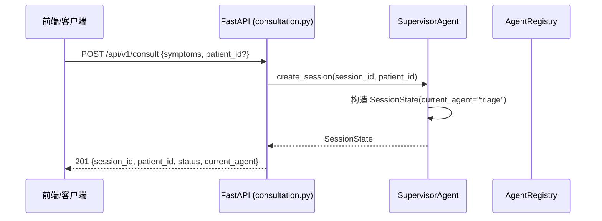
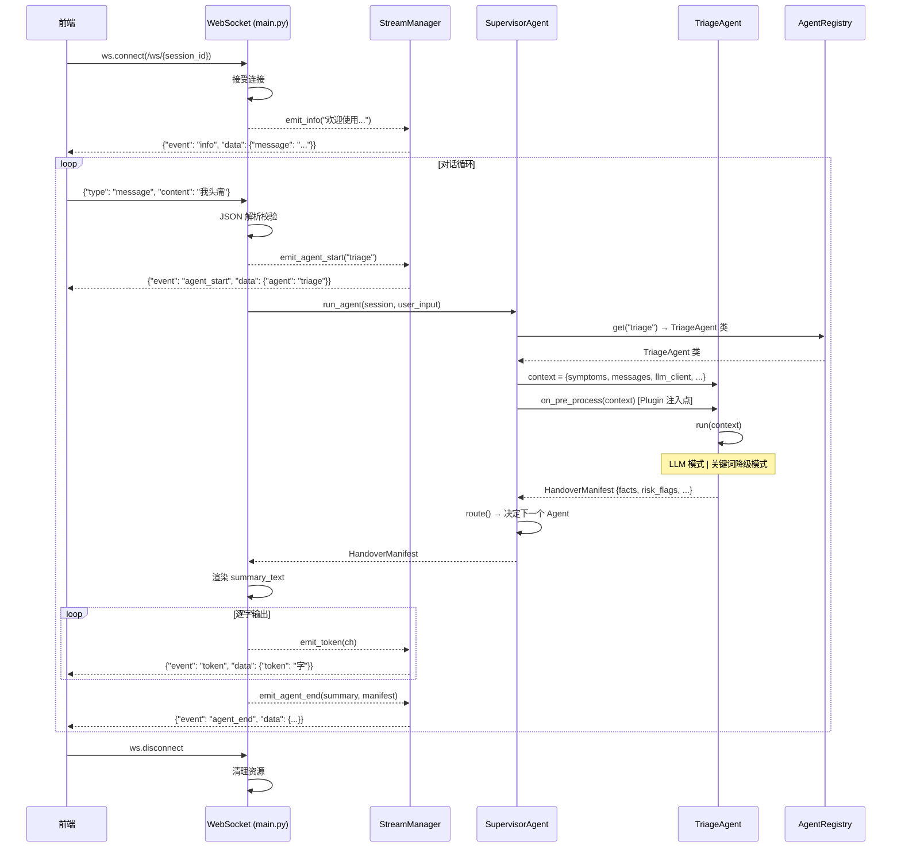
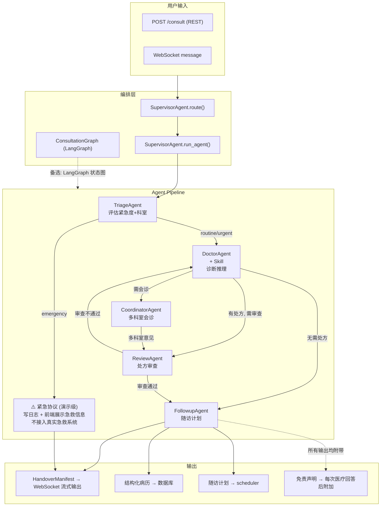
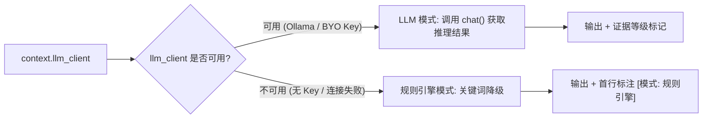
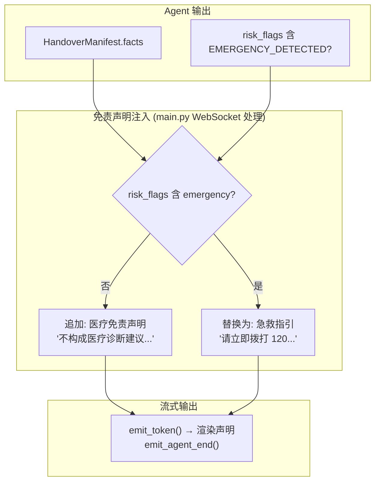
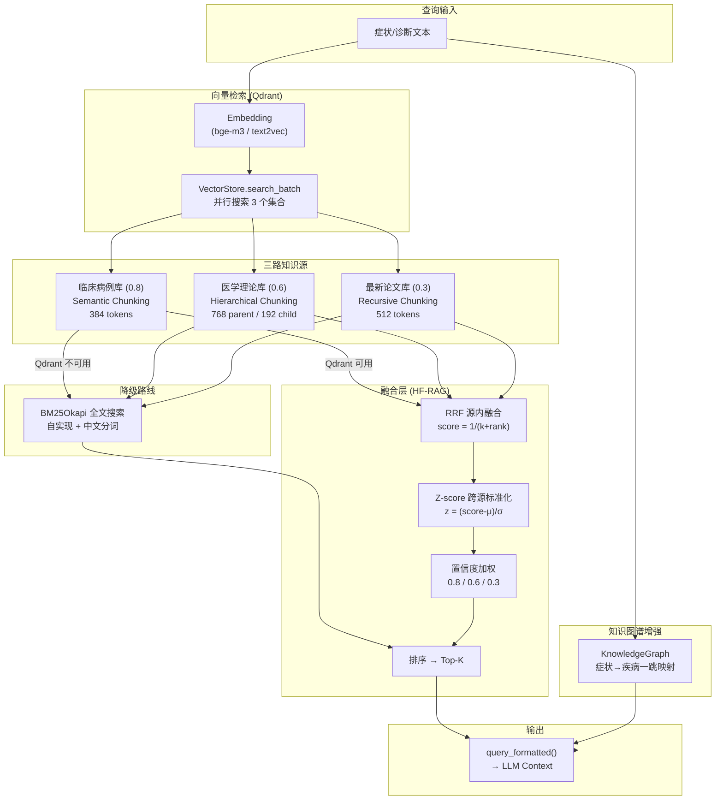

# MediNexus 数据流 (Data Flow)

> 描述请求从进入系统到输出结果的完整路径。
> 涵盖 REST / WebSocket / Agent Pipeline 三种数据流。
> 决策基线: 患者自助问诊 | Ollama 默认 + BYO Key 降级 | 紧急演示级

---

## 1. REST 问诊流 (POST /consult)



---

## 2. WebSocket 流式问诊流



---

## 3. Agent Pipeline 内部数据流



---

## 4. 数据格式转换

```
用户输入 (string)
    ↓
SupervisorAgent 构造 context dict:
  {
    "symptoms": "我头痛两天了",
    "messages": [...],
    "patient_history": "...",
    "llm_client": None | LLMClient,
    ... (plugin 注入的额外数据)
  }
    ↓
on_pre_process (Plugin Hook) → 可修改 context
    ↓
Agent.run(context) → 内部使用 context 做推理
    ↓
HandoverManifest:
  {
    "facts": ["患者症状: 头痛两天", "推荐科室: 内科"],
    "pending_questions": ["持续时间", "疼痛程度(1-10)"],
    "risk_flags": [],
    "evidence_level": "C",
    "context": {"triage_result": {...}, "department": "internal_medicine"}
  }
    ↓
on_post_process (Plugin Hook) → 可修改 manifest
    ↓
SupervisorAgent:
  - session.context.update(manifest.context)  # 累积上下文
  - route() 决定下一个 agent
  - session.current_agent = next_agent
    ↓
StreamManager → emit_token/emit_agent_end → WebSocket → 前端渲染
```

---

## 5. LLM 模式选择 (运行时决策)



### 模式标注规则
| 模式 | 标注方式 | 位置 |
|------|---------|------|
| Ollama 本地模型 | 无 (正常模式) | — |
| 用户 BYO Key (Claude/GPT) | 无 (正常模式) | — |
| 降级-规则引擎 | `"[模式: 规则引擎] 当前为离线降级模式..."` | facts 首行 |
| 降级-LLM 超时 | `"[模式: 降级] LLM 服务异常, 使用备用规则..."` | facts 首行 |

---

## 6. 免责声明注入流程



---

## 7. RAG 知识库数据流 (W4 新增)



### 降级策略

```
Qdrant 可用 + Embedding 正常 → 向量检索路线
Qdrant 不可用 / Embedding 失败 → BM25 全文搜索路线 (自动切换)
Review Agent → 独立 RAGQuery 实例 (不共享 Doctor 的 RAG 结果)
```

---

## 8. 关键数据结构关系

```
SessionState (运行时)
  ├── session_id      → WebSocket 路由
  ├── patient_id      → Patient model FK
  ├── current_agent   → AgentRegistry key
  ├── history         → [{role, content}]
  └── context         → 跨 Agent 共享字典
        ├── triage_result  → {urgency, department, reason, key_info_gaps}
        ├── diagnosis      → DoctorAgent 输出 (TODO)
        ├── prescription   → ReviewAgent 输入 (TODO)
        └── ...plugin 注入字段

HandoverManifest (Agent 间通信)
  ├── facts[]            → 显示给用户的事实列表
  ├── pending_questions[] → 还需追问的问题
  ├── risk_flags[]        → 风险标记
  ├── evidence_level      → A/B/C
  └── context             → 跨 Agent 共享 (合并入 session.context)

Consultation (持久化)
  ├── id, patient_id
  ├── status: active → triaged → diagnosed → reviewed → completed
  ├── diagnosis: Text
  └── created_at
```
