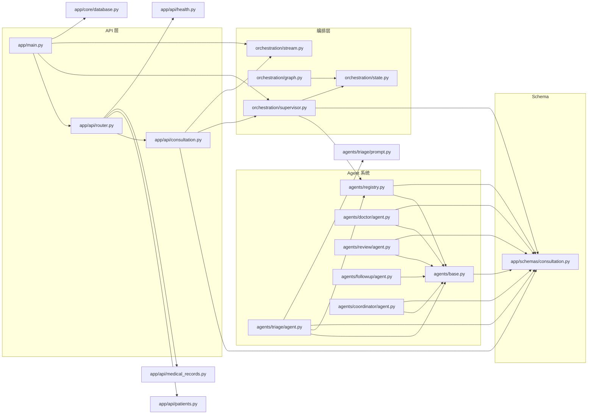

# MediNexus 依赖图 (Dependency Graph)

> Python 模块导入关系。用于理解修改某文件时的影响范围。
> 箭头方向: `A → B` 表示 "A imports B"

---

## 1. 顶层依赖



---

## 2. 完整导入表 (谁依赖于谁)

| 文件 | 直接导入 |
|------|---------|
| `agents/__init__.py` | `agents.base`, `agents.registry` |
| `agents/base.py` | `app.schemas.agent` |
| `agents/registry.py` | `agents.base`, `app.schemas.agent` |
| `agents/triage/agent.py` | `agents.base`, `agents.registry`, `app.schemas.agent`, `agents.triage.prompt` |
| `agents/doctor/agent.py` | `agents.base`, `app.schemas.agent` |
| `agents/doctor/diagnosis_flow.py` | (无) |
| `agents/review/agent.py` | `agents.base`, `app.schemas.agent` |
| `agents/coordinator/agent.py` | `agents.base`, `app.schemas.agent` |
| `agents/followup/agent.py` | `agents.base`, `app.schemas.agent` |
| `orchestration/supervisor.py` | `agents.registry`, `app.schemas.agent`, `orchestration.state` |
| `orchestration/graph.py` | `langgraph.graph`, `orchestration.state` |
| `orchestration/state.py` | (无) |
| `orchestration/stream.py` | (无) |
| `app/main.py` | `app.api.router`, `app.core.database`, `orchestration.supervisor`, `orchestration.stream` |
| `app/api/router.py` | `app.api.consultation`, `app.api.patients`, `app.api.medical_records`, `app.api.health` |
| `app/api/consultation.py` | `app.schemas.consultation`, `orchestration.supervisor`, `orchestration.stream` |
| `app/config.py` | `pydantic_settings` |
| `llm/client.py` | (抽象) |
| `knowledge/rag.py` | (TODO) |
| `memory/manager.py` | (TODO) |

---

## 3. 影响范围分析

### 核心节点 (高影响度)
修改以下文件会影响多个子系统:

| 文件 | 影响范围 |
|------|---------|
| `app/schemas/agent.py` (HandoverManifest) | 所有 Agent + Supervisor + Consultation API |
| `agents/base.py` | 所有 Agent 子类 + Registry |
| `orchestration/supervisor.py` | Consultation API + main.py + 所有 Agent |
| `agents/registry.py` | 所有 Agent + Supervisor |

### 叶节点 (低影响度)
修改以下文件局部影响:

| 文件 | 说明 |
|------|------|
| `agents/triage/prompt.py` | 仅 TriageAgent 使用 |
| `agents/doctor/diagnosis_flow.py` | 仅 DoctorAgent 使用 |
| `orchestration/state.py` | 被 supervisor.py + graph.py 导入 |
| `app/config.py` | 被 app.main 导入 |

---

## 4. 外部依赖 (第三)

```
FastAPI          → 所有 app/ 层
LangGraph        → orchestration/graph.py
SQLAlchemy       → app/models/*.py
Pydantic         → app/schemas/*.py
pydantic-settings → app/config.py
Celery           → backend/workers/tasks.py (预留)
```

基础设施依赖 (Docker Compose):
```
PostgreSQL 17    → 持久化
Redis 7          → 缓存/会话
Qdrant           → 向量检索 (预留)
```
