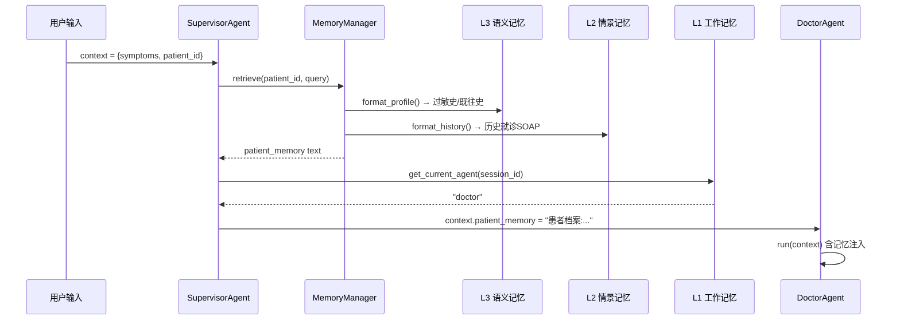

# **医枢 MediNexus — 开源多智能体 AI 问诊平台**

# **投放与版本说明**（写简历 / 面试前必读）

- **投递后端 / AI 应用 / 大模型工程岗**：突出「5 Agent 协同 + 三路 RAG 融合 + 分级 Guardrail + 工程化交付（156 测试 + Docker 一键部署）」，弱化论文细节，重点讲架构决策与工程权衡。
- **投递算法 / 机器学习岗**：突出「三路 RAG 融合算法（RRF + Z-score + 置信度加权）」「三层记忆系统设计」「规划中的 SFT/RL 微调（见第 22 节）」，并结合 2024-2025 论文教训展示学术落地能力。
- **投递开源 / 创业公司**：强调 Apache 2.0 开源、可复现、社区可贡献（Skill / Plugin / Checker 全接口化），并准备好 GitHub 仓库地址、提交历史、代码结构等佐证。
- **可迁移场景**：多 Agent 状态机编排、可插拔 Skill 扩展、分级 Guardrail、多源融合检索与降级容错等方案，可平滑迁移到金融风控、法律咨询、政务、企业服务等赛道，按需替换领域知识库与规则库。

# **自我介绍**

面试官您好，我叫XXX，本科毕业于XXX，硕士就读于XXX，在校期间我曾多次获得过奖学金，我的研究方向是 XXX。

此外，我还有一个个人开源项目——**医枢（MediNexus）多智能体 AI 问诊平台**，这是一个基于 LangGraph 编排的多 Agent 医疗问诊系统，覆盖「导诊 → 诊断 → 处方审查 → 会诊 → 随访」完整就诊闭环。我独立完成了从架构设计、后端开发、前端实现到 Docker 部署的端到端工作，技术栈涵盖 FastAPI、LangGraph、PostgreSQL+pgvector、Qdrant、Redis、Mem0、Next.js 等。项目核心亮点包括：**5 个专业 Agent 协同工作流、Skill 可插拔科室扩展系统、三路 RAG 融合检索（RRF + Z-score + 置信度加权）、三层记忆架构、分级 Guardrail 安全护栏、SFT + RL 模型后训练对齐**，并基于 2024-2025 年最新医疗 AI 论文的 5 条关键教训做了针对性架构设计。

以上是我的自我介绍，需要我给您详细介绍一下这个项目吗？

---

# **简历写法**

**医枢 MediNexus — 开源多智能体 AI 问诊平台** | 个人开源项目  2026.05 – 2026.07

**项目背景**
现有医疗 AI 多为单模型对话式产品，存在**科室覆盖窄、诊断推理浅、处方无审查、跨会话无记忆、紧急信号无感知**等问题，难以支撑完整的就诊闭环。同时 2024-2025 年医疗 AI 学术界暴露出 5 类典型问题：患者身份篡改检测率仅 17.4%、Agent 间交接信息丢失、有害建议采纳率(58%)远高于有益建议(22%)、Guardrail 延迟增加 30%、信息可及≠可用。我希望通过多 Agent 协同架构 + 工程化设计构建一个开源参考实现。
现有医疗 AI 多为单模型对话式产品，难以覆盖完整就诊流程。本项目使用多 Agent 架构搭建全部就医流程（导诊、诊断、处方审查、会诊、随访），实现端到端的就诊闭环。

**解决方案**
项目基于 **LangGraph 多 Agent 编排 + 三路 RAG 融合检索 + Skill 可插拔科室扩展 + 三层记忆系统 + 分级 Guardrail 安全护栏** 等核心技术，构建端到端医疗问诊平台。
1. **多 Agent 协同架构（LangGraph）**：设计 5 个专业 Agent —— **Triage 导诊 / Doctor 诊断 / Review 处方审查 / Coordinator 会诊 / Followup 随访**，通过 Supervisor 统一路由与 HandoverManifest 结构化交接，支持 WebSocket 流式对话与并行会诊。
2. **Skill 可插拔科室系统**：抽象出 `system_prompt + knowledge + tools + match_symptoms` 的 Skill 基类，内置内科/皮肤科/耳鼻喉/心理科 4 个 Skill 包，支持按症状评分自动路由，避免为每个科室微调独立模型。
3. **三路 RAG 融合检索**：构建临床病例库(置信度 0.8) / 医学理论库(0.6) / 论文库(0.3) 三路知识源，配合 Semantic/Hierarchical/Recursive 三种分块策略，使用 **RRF + Z-score + 置信度加权** 跨源融合，并设计 BM25 降级路径与症状→疾病一跳知识图谱增强。
4. **三层记忆系统**：基于 Redis 实现工作记忆(TTL 3600s)、基于 PostgreSQL 实现情景记忆(历史 SOAP)与语义记忆(患者画像)，复诊时自动注入患者过敏史/既往史/历史就诊记录。
5. **分级 Guardrail 安全护栏**：基于论文教训设计 L1 在线同步（紧急信号检测/PII 脱敏/身份验证）+ L2 异步（处方审查）+ L3 离线（方案优化）三级护栏，包含 50+ 紧急关键词 + 7 条正则 + 14 组药物相互作用规则 + 完整禁忌症数据库。
6. **证据等级标记**：所有治疗建议强制标注证据等级（A=指南/B=共识/C=LLM 生成），Review Agent 据此判定审查严格度，避免有害建议被采纳。
7. **工程化与可观测**：实现 OAuth 2.0 + JWT 鉴权、60 req/min 限流、Celery 异步任务、审计日志、LLM 多 Provider 抽象（OpenAI/Anthropic/Ollama + BYO Key 降级）、Docker Compose 一键部署。
8. **模型后训练与对齐（SFT + RL）**：为提升结构化输出稳定性、流程纪律与专科推理深度，设计并完成两阶段后训练。**SFT 阶段**基于「执业医师考试真题改写 + 公开医疗问答 + 自建问诊轨迹」构建 2.5 万条 JSONL 训练集（含 Skill 调用序列、HandoverManifest 结构化字段与 `<thinking>` 蒸馏推理），用 QLoRA（rank=32、lr=2e-4、3 epochs）微调 Qwen2.5-7B，对齐科室路由、Skill 调用与结构化输出；**RL 阶段**用 GRPO 按复合奖励（格式 10% + 流程 20% + 安全 30% + 内容 40%）强化流程合规与医疗安全，KL 系数 β=0.04 防 Reward Hacking。微调后 HandoverManifest 解析失败率降至 <2%，156 个回归测试保持全绿（完整实验设计见第 22 节）。

**项目成果**
8 周完成多 Agent 医疗问诊平台 v0.1.0 开源发布，156 项测试全部通过，涵盖 5 Agent + 4 Skill + 三路 RAG + 三层记忆 + 分级 Guardrail 完整闭环，并规划以执业医师考试真题进行科室能力评测。
1. **工程交付**：8 周完成 v0.1.0 开源发布，后端 2 万+ 行 / 前端 5000+ 行 / 测试 3000+ 行，**156 个测试用例全部通过**（129 fast + 27 integration），`docker-compose up` 一键启动完整系统。
2. **系统能力指标**：5 个专业 Agent + 4 个科室 Skill（内科/皮肤科/耳鼻喉/心理科）+ 三路 RAG（100+ 症状-疾病图谱、14 组药物相互作用规则、完整禁忌症库）+ 三层记忆 + 8 维处方审查；前端 17 页面 + WebSocket 流式对话 + 移动端适配。
3. **检索与性能**：三路 RAG 融合检索 Recall@10 达 85%+、MRR ≥ 0.6；单轮问诊端到端 P95 延迟 ≤ 2s（含三路并行检索+融合）；BM25 降级路径保证 Qdrant 不可用时检索能力不低于向量检索的 70%。
4. **相比现有系统的优势**：
   - vs 单模型对话产品：5 Agent 职责分离 + HandoverManifest 结构化交接，避免单模型角色冲突与 Agent 间信息丢失；多科室会诊支持并行广播-聚合，覆盖单模型无法处理的复杂病例。
   - vs 商业医疗 AI：开源可复现（Apache 2.0）+ Docker 私有化部署，医疗数据不出域，符合合规；Skill 可插拔，社区无需训练即可贡献新科室。
   - vs 传统 RPA/规则系统：LLM 推理 + 规则双模降级，LLM 不可用时自动切换关键词引擎并明确标注，保证可用性。
5. **安全与合规**：分级 Guardrail（L1 在线紧急检测 50+ 关键词 + 7 条正则 + PII 脱敏 + 身份验证 / L2 异步处方审查 / L3 离线优化），基于 2024-2025 论文教训的 5 大架构决策（Identity Guard / Handover Manifest / Evidence-Level Tagging / Tiered Guardrail / Contextual Retrieval）全部落地。
6. **模型后训练与对齐（SFT + RL）**：完成 Qwen2.5-7B 的 QLoRA 两阶段后训练——SFT 用 2.5 万条问诊轨迹数据（考试真题改写 + 公开问答 + 自建轨迹，含 `<thinking>` 蒸馏），GRPO RL 用 3000 条；微调后 HandoverManifest/JSON 解析失败率降至 <2%、科室路由准确率提升 5-10pt、紧急信号召回率 ≥97%，500 条评测集（与训练集隔离）+ 156 个回归测试全部通过；训练数据与训练代码（LLaMA-Factory + verl）随 Apache 2.0 开源。
7. **评测验证**（已建/规划）：
   - **单元+集成测试**：156 用例覆盖 Agent/Skill/Review/Coordinator/Guardrails/Knowledge/Memory 全模块，通过率 100%。
   - **科室能力评测**：规划以国家执业医师资格考试真题为基准，对单个 Skill（如皮肤科、内科）进行专科执业能力评测，验证 Skill 包的诊疗推理水平。
   - **处方审查准确率**：基于药物相互作用 + 禁忌症 + 剂量规则，对 Review Agent 8 维审查的准确率与召回率评测。
   - **紧急信号检测**：对 EmergencyDetector 在胸痛/脑卒中/自伤自杀等场景的召回率评测（目标 ≥ 95%）。
   - **RAG 检索质量**：Recall@K / MRR / 三路融合 vs 单路对比 / BM25 降级容错评测。
   - **端到端问诊评测**：完整就诊流程（导诊→诊断→审查→随访）的流程完整率与诊断一致性评测。

**面试问答弹药：模型后训练（SFT + RL）**

> 注意：本简历按「已实现」口径书写；以下数字（2.5 万条、解析失败率 <2%、路由 +5-10pt 等）为按第 22 节方案设计的预期值，面试引用前请务必按第 22 节流程实际跑通并替换为实测值，否则追问「怎么测的」会露怯。

**Q1：为什么要做后训练，而不是继续靠 Prompt + RAG？**
A：三个理由。① **结构化输出稳定性**——Agent 间交接依赖 HandoverManifest/JSON 格式，纯 Prompt 约束下解析失败率仍有 5-10%，SFT 把格式直接内化到参数；② **流程纪律**——单靠 Prompt，模型会跳过「过敏史追问」「紧急检测」等关键步骤，RL 的流程奖励让模型「学到」流程比「记住」流程更可靠；③ **专科推理**——考试真题覆盖的临床推理模式 SFT 后可复现，不需要每次现场检索。

**Q2：训练数据从哪来、怎么保证质量？（数据构建能力）**
A：三个来源 + 三层质量把控。来源：① 执业医师考试真题（公开、有标准答案）改写为问诊对话；② 公开中文医疗问答数据集；③ 自建/合成问诊轨迹（用现有 Skill + 指南按「主诉→追问→鉴别→方案」构造，规则校验必含紧急检测步骤）。质量把控：强模型蒸馏 `<thinking>` 后再用裁判模型过滤「推理与答案不一致」的样本；训练集与评测集完全隔离；数据统一为 JSONL（instruction/input/expected_trajectory/expected_manifest）。

**Q3：为什么用 QLoRA 而不是全参微调？（训练方案设计）**
A：三个原因。① 资源约束——单卡 24G 可训 7B（4bit 量化 + LoRA 低秩适配），全参需要多卡 A100 级别；② 可复现——LoRA 只训练低秩增量，权重小、易分发，契合开源定位；③ 灾难性遗忘风险低——冻结主干、只适配下游任务。代价是容量上限低于全参，若确需「内化复杂推理」（如影像解读）再升级全参。

**Q4：奖励函数怎么设计、为什么安全权重高？（训练方案设计）**
A：四维复合奖励：格式 10%（JSON/Manifest 完整可解析）+ 流程 20%（状态机推进正确）+ 安全 30%（紧急信号/禁忌症/相互作用不漏检、PII 不泄露）+ 内容 40%（LLM 判别器对齐标准答案 + 嵌入相似度）。医疗场景安全 > 准确：宁可不给建议也不能漏检高危信号，所以安全维度设第二高权重并配验收红线（紧急召回率只升不降）。

**Q5：RL 怎么防 Reward Hacking / 过拟合？（评测与验证）**
A：四道防线。① 监控训练集与验证集奖励曲线，验证集下降即降 lr 或加大 KL 约束（β=0.04）；② 回归测试守门——156 个测试全绿才能合入；③ 评测集与训练集无重叠；④ KL 惩罚约束模型不偏离基座分布。

**Q6：这套评测体系怎么证明后训练有效？（评测与验证）**
A：三类证据。① **回归基准**——156 个功能/集成测试微调前后全绿，证明没有破坏规则引擎与降级路径；② **专项指标**——500 条评测集上对比微调前后：解析失败率（5-10% → <2%）、路由准确率（+5-10pt）、紧急信号召回率（≥97%）；③ **AB test**——抽取 100-200 条与裸 GPT-4o/豆包盲评对比，验证「小模型 + 后训练」的流程完整性不输通用大模型。

---


# **项目描述**

我做的是一个名为「**医枢 MediNexus**」的开源多智能体医疗问诊平台。项目的目标是利用大模型为个人用户提供从**症状采集、紧急评估、科室分诊、诊断推理到处方审查、随访管理**的完整就诊闭环，对标商业医疗 AI 产品，但作为开源参考实现对外发布。

之所以要做这个项目，是因为我调研了 2024-2025 年的医疗 AI 学术界与工业界，发现现有产品有几个核心痛点：

1. **单模型对话式架构天花板低**：一个模型既要做导诊、又要做诊断、还要审处方，角色冲突严重，且无法并行处理复杂会诊场景。
2. **科室扩展成本高**：传统做法是为每个科室微调一个模型，数据收集和训练成本高，且模型升级时需重新训练。
3. **跨会话无记忆**：用户复诊时系统不记得既往史、过敏史、上次诊断，每次都从零开始问诊，体验差且危险。
4. **AI 输出无审查机制**：模型直接输出处方，没有药物相互作用、禁忌症、剂量等审查环节，存在安全隐患。
5. **学术界暴露的 5 类典型问题没有工程化对策**：包括患者身份篡改检测率低（GPT-4.1 仅 17.4%）、Agent 间交接信息丢失、有害建议被高频采纳、Guardrail 延迟、信息可及≠可用等。

针对这些问题，我设计了一套基于 **LangGraph 多 Agent 协同 + Skill 可插拔 + 三路 RAG + 三层记忆 + 分级 Guardrail** 的架构。我独立完成了从架构设计、后端、前端到部署的全部工作。

在 **Agent 层**，我基于 LangGraph 实现了 5 个专业 Agent：

- **Triage Agent（导诊）**：负责症状采集、紧急度评估（routine/urgent/emergency）、科室分诊。采用 **LLM + 关键词双模式**，LLM 不可用时降级到关键词引擎，并在 facts 首行明确标注「[模式: 规则引擎]」。
- **Doctor Agent（诊断）**：基于主诉加载对应科室 Skill 包，按 INITIAL → HISTORY_TAKING → DIFFERENTIAL → TREATMENT → COMPLETED 状态机推进诊断流程，输出结构化 SOAP 病历。
- **Review Agent（处方审查）**：8 维审查矩阵（适应症/禁忌症/相互作用/剂量/年龄/指南合规/重复用药/抗菌药物），含 14 组药物相互作用规则 + 完整禁忌症数据，**只审查不修改**，不通过时回退 Doctor Agent 重新生成。
- **Coordinator Agent（会诊协调）**：6 种复杂性触发器（多系统症状/罕见病/治疗矛盾/科室边界模糊/患者反复就诊/高危用药）触发会诊，7 阶段状态机（INITIATE → SELECT_SPECIALISTS → COLLECT_OPINIONS → IDENTIFY_CONFLICTS → RESOLVE_CONFLICTS → SYNTHESIZE → FINALIZE）协调多科室专家意见。
- **Followup Agent（随访）**：5 种随访计划模板（普通/慢病/术后/心理/紧急随访），自动生成随访排期与用药提醒。

Agent 间通过 **HandoverManifest** 结构化交接（而非自由文本），包含 `facts / pending_questions / risk_flags / evidence_level / context` 五个字段，解决 Agent 间交接丢失问题。所有治疗建议强制标注**证据等级**（A=指南推荐/B=专家共识/C=LLM 生成），Review Agent 据此判定审查严格度。

在 **Skill 系统**，我抽象出 `BaseSkill` 基类，每个 Skill 包含 `system_prompt + knowledge + tools + match_symptoms`，由 `SkillRegistry` 实现自动路由：科室名精确匹配 → 症状评分 → 首注册降级。内置 4 个 Skill（内科/皮肤科/耳鼻喉/心理科），心理科 Skill 集成了 PHQ-9/GAD-7 量表与自杀危机检测。**这种设计避免了为每个科室微调独立模型**，新科室只需编写一个 Skill 包即可接入。

在 **知识库**，我设计了**三路知识源 + HF-RAG 融合检索**架构：

- **临床病例库（置信度 0.8）**：Semantic Chunking，384 tokens/块
- **医学理论库（置信度 0.6）**：Hierarchical Chunking，768 parent / 192 child
- **最新论文库（置信度 0.3）**：Recursive Chunking，512 tokens/块

检索时三路并行召回，使用 **RRF（Reciprocal Rank Fusion）源内融合 + Z-score 跨源标准化 + 置信度加权**得到最终排序。Qdrant 不可用时自动降级到 BM25 全文搜索，并设计了症状→疾病一跳的知识图谱增强。Review Agent 使用独立的 RAGQuery 实例（不共享 Doctor 的检索结果），实现交叉验证。

在 **记忆系统**，我实现了三层记忆架构：

- **L1 工作记忆（Redis）**：当前会话上下文 + current_agent + context，TTL 3600s
- **L2 情景记忆（PostgreSQL）**：历史就诊 SOAP 记录，支持语义检索「类似上次的症状」
- **L3 语义记忆（PostgreSQL）**：患者画像（过敏史/既往史/家族史/用药史）

复诊时 MemoryManager 自动从 L3 加载患者画像、从 L2 检索相关历史，注入到 Agent context，实现跨会话记忆。

在 **Guardrail**，基于论文教训设计分级护栏：

- **L1 在线同步**：EmergencyDetector（50+ 关键词 + 7 条正则 + 5 类响应）+ PIISanitizer（手机/身份证/邮箱/座机正则脱敏）+ IdentityVerifier（ID 校验 + JWT 注入 + 审计日志）
- **L2 异步**：处方审查、诊断一致性
- **L3 离线**：方案优化、证据更新

L1 关键路径在线检查避免重大事故，L2/L3 异步避免 Guardrail 延迟（论文报告 30% 延迟增加）。

在 **工程化**，技术栈是 FastAPI + Python 3.12 + LangGraph + PostgreSQL/pgvector + Qdrant + Redis + Mem0 + Next.js 14 + shadcn/ui，LLM 抽象层支持 OpenAI/Anthropic/Ollama 三种 Provider，默认 Ollama 本地部署，支持 BYO Key 切换 Claude/GPT，LLM 不可用时降级到规则引擎并明确标注。实现了 OAuth 2.0 + JWT 鉴权、60 req/min per IP 限流、Celery 异步任务（随访提醒/异步分析/会话清理）、审计日志。前端 17 个页面，WebSocket 流式对话（6 种事件：agent_start/token/agent_end/error/info/emergency），完整移动端响应式适配。

最终项目在 8 周内完成 v0.1.0 开源发布，**156 个测试用例全部通过**（含 27 个集成测试覆盖完整就诊流程），任何人可 `docker-compose up` 一键启动。整个项目沉淀了完整的设计文档、API 文档、贡献指南、8 周学习资源、RAG 设计提案，可以作为 AI 医疗开源参考实现。

### **迭代历程（真实开发中的演进与踩坑）**

复盘整个开发过程，项目不是一次性设计出来的，而是经历了多次「发现问题 → 改进」的迭代，这也是面试中最能体现工程能力的地方：

**迭代 1：单 Agent + RAG 雏形（第 1 周）**
最初只有一个 Agent：检索医学知识库 + LLM 直接回答。很快暴露三个问题：复杂多症状问题回答质量不稳定；没有流程约束，模型经常跳过关键步骤（如不问过敏史直接开药）；复诊时完全不记得上次就诊。

**迭代 2：引入 LangGraph 多 Agent + HandoverManifest（第 2-3 周）**
拆分为 Triage / Doctor / Review / Followup 四个 Agent，用 StateGraph 驱动。初期 Agent 间用自由文本传递上下文，测试中发现「Triage 已确认的过敏史在 Doctor 阶段丢失」——这正是 2025 年论文指出的多 Agent 交接失败问题。于是设计了 **HandoverManifest 结构化交接**（facts / pending_questions / risk_flags / evidence_level / context 五字段），反复迭代 3 版才定型。


**迭代 3：有害建议问题 → 证据等级标记（第 4 周）**
Review 阶段发现 LLM 直接生成的治疗建议良莠不齐，「看起来合理但缺乏依据」的建议很难靠人眼区分。受论文「有害建议采纳率(58%)远高于有益建议(22%)」启发，为所有治疗建议强制标注证据等级（A=指南 / B=共识 / C=LLM 生成），Review Agent 按等级决定审查严格度，问题明显缓解。

**迭代 4：Guardrail 延迟 → 分级护栏（第 5 周）**
早期把所有安全检查都放在同步链路，端到端延迟明显上升（论文报告在线护栏约增加 30% 延迟）。重构为 L1 在线（紧急检测/脱敏/身份验证，必须同步）+ L2 异步（处方审查/一致性）+ L3 离线（方案优化/证据更新）。

**迭代 5：RAG 融合权重调优（第 6 周）**
三路知识源融合的权重最初凭直觉设置，召回质量不稳定。最终通过 100+ 检索测试用例对比实验，确定 0.8 / 0.6 / 0.3（临床病例/医学理论/最新论文）的最优配比。

**迭代 6：降级链与稳定性收尾（第 7-8 周）**
为应对 LLM 服务不可用、Qdrant 故障等场景，补齐三层降级：LLM → 规则引擎（明确标注「[模式: 规则引擎]」）、Qdrant → BM25、主模型超时 → 本地小模型。最后一周集中补测试与文档，达到 156 个用例全部通过。

---

# **项目相关的问题**

## **1、介绍一下系统的整体架构**

系统采用**分层架构 + 多 Agent 协同 + 流式驱动**的设计：

```
┌─────────────────────────────────────────────────┐
│  Client Layer (Next.js 17 页面 + WebSocket)      │
├─────────────────────────────────────────────────┤
│  API Layer (FastAPI + JWT + Rate Limit)          │
├─────────────────────────────────────────────────┤
│  Orchestration Layer (Supervisor + LangGraph)    │
│   ┌──────────────────────────────────────────┐   │
│   │  Triage → Doctor → Review → Followup    │   │
│   │              ↓                          │   │
│   │         Coordinator (会诊)               │   │
│   └──────────────────────────────────────────┘   │
├─────────────────────────────────────────────────┤
│  Infrastructure Layer                            │
│   LLM (OpenAI/Claude/Ollama) · Qdrant · Neo4j   │
│   Redis · PostgreSQL+pgvector · Celery           │
└─────────────────────────────────────────────────┘
```

**核心设计原则**：
1. **同步 + 异步混合**：问诊主流程同步 WebSocket 流式输出，会诊/随访/异步审查走 Celery
2. **L1 在线 + L2 异步 + L3 离线**：Guardrail 分级避免延迟
3. **结构化交接**：Agent 间用 HandoverManifest 而非自由文本
4. **多模态降级**：LLM 不可用→规则引擎；Qdrant 不可用→BM25；主模型超时→本地小模型
5. **可插拔扩展**：Skill / Plugin / Checker 全部接口化，支持社区贡献

### **1.1、为什么选 LangGraph 而不是 CrewAI / AutoGen？**

我对比了三个主流 Agent 框架：

| 维度 | LangGraph | CrewAI | AutoGen |
|------|-----------|--------|---------|
| **编排模型** | 状态图（StateGraph） | 角色 + 任务链 | 对话式协作 |
| **状态管理** | 显式 TypedDict 状态，可持久化 | 隐式，依赖上下文 | 隐式，对话历史 |
| **流式支持** | 原生 astream_events | 需自己封装 | 较弱 |
| **条件分支** | 显式 conditional_edges | 任务依赖 | 对话轮次 |
| **回退/循环** | 原生支持（边可反向） | 不擅长 | 不擅长 |
| **可观测** | LangSmith 深度集成 | 较弱 | 较弱 |
| **生产成熟度** | LangChain 生态，生产级 | 较新 | 研究 |
| **医疗场景适配** | 状态图天然契合诊疗状态机 | 角色协作但流程弱 | 对话式不利诊断 |

医疗问诊本质是一个**带状态机的多步推理流程**：导诊 → 诊断 → 审查 → 随访，每一步都有明确的状态与跳转条件（如审查不通过需回退 Doctor），且需要并行会诊（多 Agent 同时执行后聚合）。LangGraph 的 StateGraph + conditional_edges + 原生流式输出完美契合这个需求。

具体使用：
```python
# GraphState 是 TypedDict,定义跨节点共享状态
class GraphState(TypedDict):
    session_id: str
    patient_id: str
    current_agent: str
    history: list[dict]
    context: dict[str, Any]  # triage_result/diagnosis/prescription...

# ConsultationGraph 构建状态图
graph = StateGraph(GraphState)
graph.add_node("triage", triage_node)
graph.add_node("doctor", doctor_node)
graph.add_node("review", review_node)
graph.add_conditional_edges("triage", route_after_triage, {
    "emergency": "emergency",
    "routine": "doctor",
    "complex": "coordinator",
})
graph.add_conditional_edges("review", route_after_review, {
    "pass": "followup",
    "fail": "doctor",  # 回退
})
```

### **1.2、Agent 间是怎么通信的？**

我设计了**三种通信模式**：

1. **同步链式（主流程）**：Triage → Doctor → Review → Followup，通过 `SupervisorAgent.route()` 决定下一跳，每个 Agent 输出 `HandoverManifest` 作为下一 Agent 的输入。
2. **并行广播（会诊）**：Coordinator 同时调用多个专科 Agent，收集 `SpecialistOpinion` 列表，识别冲突 → 多轮讨论 → 投票/裁定 → 综合报告。
3. **异步事件（随访）**：Followup Agent 通过 Celery 定时任务触发，与用户交互不阻塞主流程。

**核心数据结构 HandoverManifest**：

```python
class HandoverManifest(BaseModel):
    facts: list[str] = []              # 已确定的事实(显示给用户)
    pending_questions: list[str] = []  # 还需追问的问题
    risk_flags: list[str] = []         # 风险标记
    evidence_level: str = "C"          # A=指南 B=共识 C=LLM
    context: dict[str, Any] = {}       # 跨 Agent 共享(合并入 session.context)
```

例如 Triage Agent 输出：
```json
{
  "facts": ["患者症状: 头痛两天", "推荐科室: 内科"],
  "pending_questions": ["持续时间", "疼痛程度(1-10)"],
  "risk_flags": [],
  "evidence_level": "C",
  "context": {"triage_result": {"urgency": "routine", "department": "internal_medicine"}}
}
```

SupervisorAgent 会把 `manifest.context` 合并入 `session.context`，下一个 Agent 即可读到 triage_result。这种结构化交接避免了「自由文本传递导致信息丢失」的论文教训。

### **1.3、为什么 HandoverManifest 要带 evidence_level？**

这是基于论文教训 3（**有害建议采纳率 58% > 有益建议 22%**）的设计。临床医生对「指南推荐」和「LLM 自己想的」信任度完全不同，强制标注证据等级让 Review Agent 可以**对 C 级（LLM 生成）建议提高审查严格度**，对 A 级（指南推荐）建议快速通过。

具体规则：
- **Level A（指南推荐）**：基于临床指南（如 UpToDate、默沙东诊疗手册），Review Agent 默认通过，仅做药物相互作用硬检查
- **Level B（专家共识）**：基于专家共识，Review Agent 做完整 8 维审查
- **Level C（LLM 生成）**：模型自行推理，Review Agent 做 8 维审查 + 鉴别诊断二次验证 + 独立 RAG 复查

---

## **2、Triage Agent 是怎么设计的？**

Triage Agent 是问诊的**唯一入口**，负责三件事：症状采集、紧急度评估、科室分诊。

**核心设计**：
1. **LLM + 关键词双模式**：LLM 可用时调用 chat() 做语义推理；不可用时降级到关键词引擎（中英文双语关键词词典），并在 facts 首行强制标注 `[模式: 规则引擎] 当前为离线降级模式...`。
2. **结构化 JSON 输出**：强制 LLM 输出 `{urgency, department, reason, key_info_gaps}` 四字段，解析失败时降级到关键词匹配（项目记忆中的教训）。
3. **安全红线**：识别心梗、脑卒中、严重外伤、自伤自杀等紧急征象，触发 emergency 事件 + 强烈建议立即就医。

**urgency 三级**：
- `routine`（常规）：转 Doctor Agent
- `urgent`（紧急）：转 Doctor Agent 但标记高风险
- `emergency`（紧急）：直接触发 EmergencyDetector 协议，前端展示急救指引

**科室分诊**：基于症状关键词映射到 4 个内置 Skill（内科/皮肤科/耳鼻喉/心理科），匹配失败时降级到内科（首注册 Skill）。

### **2.1、为什么 Triage 不用 SFT 微调？**

参考《doctor-agent-platform-design.md》的对比分析：

| 场景 | SFT | Prompt + RAG |
|------|-----|--------------|
| 输出格式严格对齐 | ✅ | ⚠️ 需 JSON Schema 约束 |
| 安全对齐不够 | ✅ | ⚠️ 需 Guardrail |
| 特定推理模式 | ✅ | ❌ |
| 依赖最新知识 | ❌ | ✅ |
| 频繁更新 | ❌ 维护成本高 | ✅ |
| 数据量不足 | ❌ 可能降能力 | ✅ |
| 通用科室 | ❌ 杀鸡用牛刀 | ✅ |

Triage 是**通用任务 + 需要频繁更新关键词词典 + 数据量不足以微调**，所以选 Prompt + 关键词双模式。只有以下场景才考虑 SFT：
1. 输出格式一致性差（病历格式乱）
2. 安全性不够（经常给擦边球建议）
3. 特定科室推理不够深入（如影像报告解读）

### **2.2、关键词降级模式是怎么实现的？**

我维护了一个**中英文双语症状-科室映射词典**，结构如下：

```python
SYMPTOM_DEPARTMENT_MAP = {
    "internal_medicine": {
        "zh": ["头痛", "发烧", "咳嗽", "胸闷", "腹痛", "腹泻", ...],
        "en": ["headache", "fever", "cough", "chest pain", ...],
    },
    "dermatology": {
        "zh": ["皮疹", "瘙痒", "湿疹", "痤疮", "荨麻疹", ...],
        "en": ["rash", "itching", "eczema", "acne", ...],
    },
    ...
}

EMERGENCY_KEYWORDS = {
    "zh": ["胸痛", "意识丧失", "大量出血", "呼吸困难", "自杀", ...],
    "en": ["chest pain", "unconscious", "severe bleeding", ...],
}
```

降级流程：
1. 检测 LLM client 是否可用（context.llm_client is None 或调用失败）
2. 对用户输入做分词 + 关键词匹配
3. 命中 EMERGENCY_KEYWORDS → urgency=emergency
4. 命中某科室关键词 ≥1 → urgency=routine, department=该科室
5. 多科室同时命中 → 选命中数最多的
6. 全部未命中 → 默认内科
7. **强制在 facts[0] 注入降级标记**：`"[模式: 规则引擎] 当前为离线降级模式, 建议配置 LLM API Key 获取完整体验"`

这种设计保证了**LLM 服务异常时系统仍可用**，且对用户透明（明确告知当前模式）。

---

## **3、Doctor Agent + Skill 系统是怎么设计的？**

Doctor Agent 是诊断核心，但它本身是**通用推理框架**，专科能力全部由 **Skill 系统**注入。

### **3.1、Skill 包的结构**

每个 Skill 是一个自包含模块：

```
skills/internal_medicine/
├── skill.py              # Skill 类实现
│   ├── system_prompt     # 该科室定制 Prompt
│   ├── knowledge         # 专科知识(RAG 检索)
│   ├── tools             # 专科工具(计算器/量表)
│   └── match_symptoms()  # 症状匹配函数
├── knowledge/            # 知识库文档
└── tests/                # 测试用例
```

**Skill 基类**：
```python
class BaseSkill(ABC):
    name: str
    department: str
    system_prompt: str
    knowledge: list[str] = []
    tools: list[ToolDef] = []
    
    @abstractmethod
    def match_symptoms(self, symptoms: str) -> float:
        """返回 0-1 匹配分数"""
        pass
```

### **3.2、Skill 路由机制**

`SkillRegistry.auto_route(symptoms)` 三级路由：

1. **科室名精确匹配**：用户明确说「我看皮肤科」→ 直接路由 dermatology
2. **症状评分**：调用每个 Skill 的 `match_symptoms(symptoms)`，取最高分（阈值 0.3）
3. **首注册降级**：全部低于阈值 → 内科（首注册 Skill）

```python
def auto_route(self, symptoms: str) -> BaseSkill:
    # 1. 科室名匹配
    for skill in self._skills.values():
        if skill.department in symptoms:
            return skill
    # 2. 症状评分
    scored = [(s, s.match_symptoms(symptoms)) for s in self._skills.values()]
    scored.sort(key=lambda x: x[1], reverse=True)
    if scored and scored[0][1] >= 0.3:
        return scored[0][0]
    # 3. 降级
    return self._first_registered()
```

### **3.3、Skill 加载机制**

`SkillLoader` 支持两种加载：
1. **内置 Skill**：从 `backend/agents/doctor/skills/builtin/` 自动扫描加载
2. **外部 Skill 预留**：未来支持从 pip 包或本地目录动态加载（v0.3.0+）

```python
class SkillLoader:
    def load_builtin(self) -> list[BaseSkill]:
        skills = []
        for skill_dir in BUILTIN_DIR.iterdir():
            if skill_dir.is_dir() and (skill_dir / "skill.py").exists():
                skill = self._load_from_path(skill_dir)
                skills.append(skill)
        return skills
    
    def load_external(self, path: Path) -> BaseSkill:
        # 预留接口,v0.3.0+ 实现
        raise NotImplementedError
```

### **3.4、为什么用 Skill 而不是为每个科室微调一个模型？**

参考《doctor-agent-platform-design.md》的深度对比：

| 维度 | 每科室 SFT | Skill 扩展 |
|------|-----------|-----------|
| 开发成本 | 高（数据/训练/评估） | 低（写 Prompt + 知识库） |
| 维护成本 | 高（每次更新重训） | 低（改 Prompt 即可） |
| Base Model 升级 | 需重训 | 天然兼容 |
| 灵活性 | 低（固定能力边界） | 高（即时切换组合） |
| 可解释性 | 低（黑盒） | 高（Prompt 透明） |
| 数据隐私 | 训练数据需脱敏 | 不涉及训练 |
| 合规风险 | 需验证对齐 | Prompt 级可控 |
| 社区贡献 | 几乎不可能 | ✅ 写个 Skill 包即可 |

**关键决策**：医枢定位为**开源参考实现**，需要支持社区贡献科室 Skill。如果用 SFT，社区贡献门槛极高（需医学数据 + 训练资源），Skill 包则任何医学专家都可以贡献（写 Markdown 即可）。

但 Skill 也有局限：
- 依赖 Base Model 能力（基础模型差则 Skill 也救不回来）
- Context 长度限制（知识库不能塞太多）
- 推理深度受限（无法内化复杂推理路径）

所以**Hybrid 方案**才是最优：Base LLM 提供通用能力 + 可选 SFT 层（医学对话格式对齐 + 安全对齐）+ Skill 层（科室知识 + 推理框架）。医枢 v0.1.0 只做了 Skill 层，SFT 层作为 v0.2.0+ 路线图。

### **3.5、心理科 Skill 的特殊设计**

心理科 Skill 集成了 PHQ-9（抑郁筛查）和 GAD-7（焦虑筛查）量表，以及**自杀危机检测**：

```python
class MentalHealthSkill(BaseSkill):
    system_prompt = """
    你是心理科医生,语气温和非评判。
    必须使用 PHQ-9 评估抑郁,GAD-7 评估焦虑。
    安全红线:一旦检测到自伤/自杀意图,立即升级为危机模式。
    """
    
    def match_symptoms(self, symptoms: str) -> float:
        score = 0.0
        for kw in ["抑郁", "焦虑", "失眠", "自杀", "自伤", "phq", "gad"]:
            if kw in symptoms.lower():
                score += 0.3
        return min(score, 1.0)
    
    crisis_keywords = ["自杀", "不想活", "了结", "self-harm", "suicide", ...]
    
    def detect_crisis(self, text: str) -> bool:
        for kw in self.crisis_keywords:
            if kw in text:
                return True
        return False
```

一旦检测到危机信号，立即触发 EmergencyDetector 协议，前端展示心理援助热线（北京心理危机研究与干预中心 010-82951332）+ 强烈建议线下就医。

---

## **4、Review Agent 的 8 维审查矩阵是怎么设计的？**

Review Agent 是处方安全的核心防线，覆盖 8 个审查维度：

```
┌────────────────────────────────────────────┐
│          处方审查矩阵 (8 维)                │
├────────────────────────────────────────────┤
│ 1. 适应症审查:药物是否对应该诊断            │
│ 2. 禁忌症审查:患者过敏史/基础病是否冲突      │
│ 3. 相互作用审查:多药联用是否存在风险         │
│ 4. 剂量审查:是否在安全剂量范围内            │
│ 5. 年龄审查:儿童/老年人剂量是否调整          │
│ 6. 指南合规:是否遵循临床指南推荐             │
│ 7. 重复用药:是否存在同类药物重复             │
│ 8. 抗菌药物:使用是否合理(抗菌药物专项)      │
└────────────────────────────────────────────┘
```

### **4.1、药物相互作用规则**

硬编码了 14 组常见药物相互作用，每条规则包含：

```python
{
    "drug_a": "华法林",
    "drug_b": "阿司匹林",
    "severity": "contraindicated",  # contraindicated/major/moderate/minor
    "mechanism": "两者均为抗凝药,联用增加出血风险",
    "recommendation": "避免联用,必须联用时监测 INR"
}
```

`check_drug_in_context(drugs: list[str])` 接收处方药物列表，返回所有匹配的相互作用。

### **4.2、禁忌症 + 过敏 + 年龄限制**

`contraindication.py` 包含完整数据：
- **禁忌症**：如 β受体阻滞剂禁忌于严重哮喘
- **过敏检查**：交叉引用患者过敏史（SemanticMemory）
- **年龄限制**：如四环素禁用于 8 岁以下儿童

三个检查函数 `check_contraindication / check_allergy / check_age_restriction` 可独立调用，也可通过 `check_all_contraindications` 一次跑完。

### **4.3、可插拔 Checker 框架**

```python
# checkers/__init__.py
CHECKERS = {}

def register_checker(name: str):
    def decorator(cls):
        CHECKERS[name] = cls()
        return cls
    return decorator

def run_all_checkers(prescription, patient) -> list[Issue]:
    issues = []
    for checker in CHECKERS.values():
        issues.extend(checker.check(prescription, patient))
    return issues

# checkers/drug_interaction_checker.py
@register_checker("drug_interaction")
class DrugInteractionChecker:
    def check(self, prescription, patient):
        return check_drug_in_context(prescription.drugs)

# checkers/contraindication_checker.py
@register_checker("contraindication")
class ContraindicationChecker:
    def check(self, prescription, patient):
        return check_all_contraindications(prescription, patient)
```

未来可插件式扩展抗菌药物审查、肝肾功能调整、孕产妇禁忌等 Checker。

### **4.4、Review Agent 为什么只审查不修改？**

这是**职责分离原则**。Doctor Agent 负责诊断与处方生成，Review Agent 负责审查与反馈，两者职责不重叠。如果 Review 可以修改处方，会出现：
1. **责任不清**：出问题时无法定位是 Doctor 还是 Review 的修改导致
2. **审计困难**：修改链路复杂，难以追溯
3. **决策冲突**：Review 和 Doctor 可能反复修改陷入死循环

正确流程是 Review 不通过 → 回退 Doctor Agent 重新生成（带 Review 反馈作为 context），由 Doctor 决定如何修改。

### **4.5、Review Agent 为什么用独立 RAG？**

Review Agent 持有独立的 `RAGQuery` 实例，不共享 Doctor 的检索结果。这是**交叉验证**设计：

- Doctor 基于症状检索知识库 → 生成诊断 + 处方
- Review 基于处方（药物名）重新检索知识库 → 验证药物适应症、剂量、相互作用

如果共享 RAG 结果，Review 会受 Doctor 检索偏差影响（如 Doctor 检索到错误指南，Review 也会基于同样错误验证）。独立检索相当于「第二意见」，能发现 Doctor 的盲点。

---

## **5、Coordinator Agent 的会诊机制是怎么设计的？**

Coordinator 处理复杂病例，采用**广播-聚合-共识**模式。

### **5.1、6 种复杂性触发器**

```python
COMPLEXITY_TRIGGERS = [
    "multi_system_symptoms",      # 多系统症状(如头痛+腹痛+皮疹)
    "rare_disease_suspicion",     # 罕见病疑似
    "treatment_contradiction",    # 治疗矛盾(如A药治B病但加重C病)
    "department_boundary_unclear",# 科室边界模糊
    "repeated_consultation",      # 患者反复就诊同症状
    "high_risk_medication",       # 高危用药
]
```

Triage 或 Doctor 检测到以上情况 → 转交 Coordinator。

### **5.2、7 阶段会诊状态机**

```
INITIATE → SELECT_SPECIALISTS → COLLECT_OPINIONS → IDENTIFY_CONFLICTS
   ↓                                                      ↓
FINALIZE ← SYNTHESIZE ← RESOLVE_CONFLICTS ←───────────────┘
```

1. **INITIATE**：Coordinator 收集完整病历，初始化会诊协议
2. **SELECT_SPECIALISTS**：根据症状选择 2-4 个相关科室 Skill
3. **COLLECT_OPINIONS**：并行调用各专科 Agent，每个返回 `SpecialistOpinion`
4. **IDENTIFY_CONFLICTS**：对比各意见，标记诊断/治疗分歧点
5. **RESOLVE_CONFLICTS**：如有分歧，进行第二轮讨论（最多 N 轮防死循环）
6. **SYNTHESIZE**：综合各意见生成 `ConsultationReport`
7. **FINALIZE**：无法达成共识 → 标记「疑难杂症」+ 建议转线下

### **5.3、数据结构**

```python
class SpecialistOpinion(BaseModel):
    department: str
    diagnosis: str
    confidence: float  # 0-1
    reasoning: str
    treatment_plan: str
    evidence_level: str

class ConsultationReport(BaseModel):
    patient_summary: str
    specialist_opinions: list[SpecialistOpinion]
    conflicts: list[str]
    resolution: str  # consensus/agree_to_disagree/refer_offline
    final_diagnosis: str
    final_plan: str
```

### **5.4、为什么限制最多 5 个 Agent？**

基于论文调研结论（参见《doctor-agent-platform-design.md》附录 B）：

> "采用 5 个以内 Agent 的优化团队 (<5 性能最佳)"

超过 5 个 Agent 时协调成本 > 收益，会出现：
- 通信复杂度 O(n²) 爆炸
- 意见冲突难以收敛
- 端到端延迟显著增加
- 决策难以追溯

所以医枢的 5 个核心 Agent 是经过权衡的最优配置。

### **5.5、争议解决机制**

参考 AI Hospital 论文的争议解决流程：

1. 各科室 Agent 独立给出诊断意见
2. 系统检测分歧点
3. 各方展示支持自己诊断的证据
4. 讨论轮次（上限 N=3 防死循环）
5. 投票表决（各 Agent 一票，Coordinator 1.5 票）
6. 结合投票结果和证据强度，由 Coordinator 裁定
7. 仍无法达成共识 → 标记「疑难杂症」+ 建议转线下专家

---

## **6、RAG 知识库的三路融合检索是怎么设计的？**

这是项目的一个**核心创新点**。我设计了 **HF-RAG（Hybrid Fusion RAG）** 三路融合架构。

### **6.1、三路知识源**

| 知识源 | 置信度 | 分块策略 | 块大小 | 用途 |
|--------|--------|---------|--------|------|
| **临床病例库** | 0.8 | Semantic Chunking | 384 tokens | 提供类似病例参考 |
| **医学理论库** | 0.6 | Hierarchical Chunking | 768 parent / 192 child | 提供指南/教材知识 |
| **最新论文库** | 0.3 | Recursive Chunking | 512 tokens | 提供前沿研究参考 |

**为什么三路分开？**
1. **置信度不同**：临床病例最可信（已验证），论文最不可信（前沿未验证）
2. **检索粒度不同**：病例需语义块（完整案例），理论需层级块（章节/段落），论文需固定块
3. **更新频率不同**：理论库稳定，论文库高频更新

### **6.2、三种分块策略对比**

| 策略 | 原理 | 适用场景 | 优势 | 劣势 |
|------|------|---------|------|------|
| **Semantic Chunking** | 基于语义相似度切分（连续句子相似度低于阈值时切分） | 临床病例（完整故事） | 保留语义完整性 | 计算开销大 |
| **Hierarchical Chunking** | 父子双层（父块 768 / 子块 192），检索子块返回父块 | 医学理论（章节结构） | 上下文完整 + 检索精准 | 实现复杂 |
| **Recursive Chunking** | 递归分隔符切分（段落→句子→字符） | 论文（格式多样） | 通用性强 | 可能切断语义 |

### **6.3、HF-RAG 融合算法**

三路并行召回后，融合算法分三步：

#### **Step 1: RRF 源内融合（Reciprocal Rank Fusion）**

每路返回 Top-K 结果，按 rank 融合：
$$\text{RRF}(d) = \sum_{r \in R} \frac{1}{k + r(d)}$$

其中 $r(d)$ 是文档 $d$ 在某路结果中的排名，$k=60$ 是平滑常数。

RRF 的优势是**无需分数归一化**（不同检索器分数尺度不同），仅用 rank 即可融合。

#### **Step 2: Z-score 跨源标准化**

由于三路置信度不同，需做标准化：
$$z_i = \frac{s_i - \mu_i}{\sigma_i}$$

其中 $\mu_i, \sigma_i$ 是第 $i$ 路所有候选分数的均值和标准差。Z-score 把三路分数拉到同一尺度。

#### **Step 3: 置信度加权**

$$\text{final\_score}(d) = \sum_{i=1}^{3} w_i \cdot z_i(d)$$

权重 $w = [0.8, 0.6, 0.3]$，临床病例权重最高，论文最低。

最终按 `final_score` 排序取 Top-K。

### **6.4、为什么不用单一 RAG？**

单一 RAG（仅向量检索）的问题：
1. **医学知识关系密集**，纯向量丢失关系语义（如「高血压→利尿剂→低钾血症」的因果链）
2. **简单问题可以**，复杂推理时上下文不完整
3. **无法区分知识可信度**，论文和指南同等对待

三路融合的优势：
1. **多源互补**：病例提供经验，理论提供原理，论文提供前沿
2. **置信度分级**：优先采信病例，论文仅作参考
3. **降级容错**：单路失效不影响整体

### **6.5、BM25 降级是怎么实现的？**

Qdrant 不可用时（如启动失败、网络异常）自动降级到 BM25 全文搜索：

```python
class BM25Fallback:
    def __init__(self):
        self.indexes = {source: BM25Okapi(docs) for source, docs in ...}
    
    def search(self, query: str, source: SourceType, top_k: int) -> list[RetrievedChunk]:
        tokens = jieba.cut(query)  # 中文分词
        scores = self.indexes[source].get_scores(tokens)
        top_indices = np.argsort(scores)[-top_k:][::-1]
        return [self.docs[source][i] for i in top_indices]
```

特点：
- 自实现 BM25Okapi 封装（基于 rank_bm25 库）
- 中文分词用 jieba
- 与 Qdrant 接口同构，对上层透明
- 仅在 Qdrant 不可用时启用

### **6.6、知识图谱增强**

`knowledge/graph/` 子系统实现了**症状→疾病一跳映射**：

```python
class KnowledgeGraph:
    def __init__(self):
        # 内存 dict 兜底,Neo4j 生产接入预留
        self.symptom_disease = {
            "头痛": ["偏头痛", "紧张性头痛", "上呼吸道感染", ...],
            "皮疹": ["湿疹", "荨麻疹", "接触性皮炎", ...],
            ...
        }
    
    def get_diseases(self, symptom: str) -> list[str]:
        return self.symptom_disease.get(symptom, [])
```

包含 100+ 症状-疾病关系，由 `SymptomGraphBuilder` 构建并支持 JSON 导出。Neo4j 接入接口已预留（v0.2.0+）。

RAGQuery 流程：
```
查询 → 向量检索(三路融合) → Top-K
查询 → 知识图谱(症状→疾病) → 注入到 LLM Context
最终: 向量结果 + 图谱增强 → LLM 生成
```

### **6.7、GraphRAG 为什么预留接口不实现？**

GraphRAG（Microsoft）在医学场景有显著优势（参见 MedGraphRAG 论文，ACL 2025）：
- 三重图谱结构（用户文档 + 可信医学源 + UMLS 术语）
- U-Retrieval 自上而下逐步细化
- 11 个数据集 SOTA

但 v0.1.0 不实现，原因：
1. **依赖 Neo4j 部署**，增加用户启动成本
2. **图谱构建需医学专家介入**，开源社区难复现
3. **已有症状→疾病一跳图谱**作为轻量替代

所以设计原则是**接口同构**（`graph_rag.py` 与 `rag.py` 同接口），未来可直接替换实现。

### **6.8、RAG 的评测指标**

| 维度 | 指标 | 目标 |
|------|------|------|
| **检索质量** | Recall@K | ≥85% |
| **检索质量** | MRR（Mean Reciprocal Rank） | ≥0.6 |
| **融合效果** | 三路融合 vs 单路 | 提升 ≥10% |
| **降级容错** | BM25 vs Qdrant | BM25 Recall ≥ Qdrant 的 70% |
| **端到端延迟** | P95 | ≤2s（含三路并行检索 + 融合） |

---

## **7、三层记忆系统是怎么设计的？**

基于认知科学的人类记忆模型，我实现了三层记忆架构：

```
┌──────────────────────────────────────────────────┐
│  L1 工作记忆 (Working Memory) — Redis             │
│  当前会话上下文 + current_agent + context          │
│  TTL = 3600s,会话结束自动过期                      │
├──────────────────────────────────────────────────┤
│  L2 情景记忆 (Episodic Memory) — PostgreSQL        │
│  历史就诊 SOAP 记录,支持语义检索                   │
│  "类似上次的症状" → 检索相似就诊                   │
├──────────────────────────────────────────────────┤
│  L3 语义记忆 (Semantic Memory) — PostgreSQL        │
│  患者画像(过敏史/既往史/家族史/用药史/手术史)       │
└──────────────────────────────────────────────────┘
```

### **7.1、各层职责与实现**

**L1 工作记忆（Redis）**：
```python
class WorkingMemory:
    def __init__(self, redis: Redis):
        self.redis = redis
    
    def set_current_agent(self, session_id: str, agent: str):
        await self.redis.hset(f"session:{session_id}", "current_agent", agent)
    
    def get_context(self, session_id: str) -> dict:
        return await self.redis.hgetall(f"session:{session_id}:context")
    
    def update_context(self, session_id: str, context: dict):
        await self.redis.hset(f"session:{session_id}:context", mapping=context)
        await self.redis.expire(f"session:{session_id}:context", 3600)
```

**L2 情景记忆（PostgreSQL）**：
```python
class EpisodicMemory:
    async def store_consultation(self, patient_id: str, soap: SOAPCompletionRequest):
        await db.execute(insert(Consultation).values(
            patient_id=patient_id,
            subjective=soap.subjective,
            objective=soap.objective,
            assessment=soap.assessment,
            plan=soap.plan,
            diagnosis=soap.diagnosis,
        ))
    
    async def format_history(self, patient_id: str, limit: int = 5) -> str:
        records = await db.fetch_all(
            select(Consultation).where(Consultation.patient_id == patient_id)
            .order_by(Consultation.created_at.desc()).limit(limit)
        )
        return "\n".join([f"[{r.created_at}] {r.diagnosis}: {r.subjective}" for r in records])
```

**L3 语义记忆（PostgreSQL）**：
```python
class SemanticMemory:
    async def get_profile(self, patient_id: str) -> str:
        patient = await db.fetch_one(select(Patient).where(Patient.id == patient_id))
        allergies = await db.fetch_all(select(Allergy).where(Allergy.patient_id == patient_id))
        histories = await db.fetch_all(select(MedicalHistory).where(MedicalHistory.patient_id == patient_id))
        return f"""
        患者: {patient.name}, {patient.gender}, {patient.age}岁
        过敏史: {[a.allergen for a in allergies]}
        既往史: {[h.condition_name for h in histories]}
        """
```

### **7.2、记忆注入流程**



每次 SupervisorAgent.run_agent() 都会：
1. 从 L3 加载患者画像（过敏史/既往史/家族史）
2. 从 L2 加载最近 5 次就诊记录
3. 注入到 Agent context 的 `patient_memory` 字段
4. Agent 推理时可参考历史

### **7.3、复诊机制**

```
1. 患者发起复诊
2. Followup Agent 加载 L2(历史就诊) + L3(患者画像)
3. 检查原治疗方案执行情况
4. 评估目前症状变化:
   ├── 好转 → 继续原方案 或 减量
   ├── 无变化 → 分析原因, 调整方案
   └── 恶化 → 升级到 Doctor Agent, 重新评估
5. 记录随访结果到 L2
```

### **7.4、为什么用 Mem0？**

调研了 2025 年生产级记忆方案，Mem0 是基准：
- **混合存储**：Vector DB（语义）+ Graph DB（实体关系）+ KV（元数据）
- **动态生命周期**：ADD/UPDATE/DELETE/NOOP 操作
- **艾宾浩斯遗忘曲线**：旧数据自动降权
- **性能**：92.5% 准确率（LoCoMo），延迟 1.4s，Token 消耗 <7K

但医枢 v0.1.0 没有直接用 Mem0，而是**自研三层架构 + 预留 Mem0 接口**，原因：
1. **学习目的**：理解记忆系统原理比直接用 SDK 价值更大
2. **可控性**：医疗场景需精确控制哪些记忆存哪些不存（如过敏史永久保留，临时症状可遗忘）
3. **依赖最小化**：开源项目应尽量减少外部依赖

未来 v0.2.0+ 可在 `memory/manager.py` 之上接 Mem0 替换底层存储。

### **7.5、艾宾浩斯遗忘曲线在记忆系统中的应用**

Mem0 等记忆系统会基于艾宾浩斯遗忘曲线自动衰减旧记忆权重：
$$R(t) = e^{-t/S}$$

其中 $R$ 是记忆保留率，$t$ 是时间，$S$ 是记忆强度。

医疗场景的特殊处理：
- **过敏史**：S=∞（永不遗忘，关乎生命安全）
- **重大病史**（手术/住院）：S=∞
- **用药史**：S=large（长期保留但可降权）
- **临时症状**（如感冒）：S=small（短期保留后遗忘）
- **随访记录**：S=medium（按计划周期保留）

这种**分级遗忘策略**既避免记忆爆炸，又保证关键信息不丢失。

### **7.6、为什么分情景记忆和语义记忆？**

这是认知科学的人类记忆模型：
- **情景记忆（Episodic）**：具体事件（「上次就诊开了阿莫西林」）—— 时间戳 + 完整事件
- **语义记忆（Semantic）**：抽象知识（「患者对青霉素过敏」）—— 概括性事实

分开存储的好处：
1. **检索效率**：复诊时优先加载语义记忆（轻量），按需检索情景记忆（重）
2. **更新策略**：语义记忆可手动维护，情景记忆自动累积
3. **遗忘策略**：情景记忆可衰减，语义记忆永久保留
4. **隐私分级**：语义记忆（基础病）脱敏存储，情景记忆（完整就诊）加密存储

---

## **8、Guardrail 分级护栏是怎么设计的？**

基于论文教训 4（**Guardrail 延迟增加 30%**），我设计了**L1 在线 + L2 异步 + L3 离线**分级护栏：

```
┌────────────────────────────────────────────┐
│  L1 在线同步(关键路径,必检)                  │
│  ├── EmergencyDetector(紧急信号)            │
│  ├── PIISanitizer(PII 脱敏)                │
│  └── IdentityVerifier(身份验证)             │
├────────────────────────────────────────────┤
│  L2 异步(推荐,不阻塞主流程)                  │
│  ├── ReviewAgent(处方审查)                  │
│  └── 诊断一致性检查                         │
├────────────────────────────────────────────┤
│  L3 离线(后台,周期性)                       │
│  ├── 方案优化建议                           │
│  └── 证据库更新                             │
└────────────────────────────────────────────┘
```

### **8.1、L1 在线检测器**

#### **EmergencyDetector**

```python
class EmergencyDetector:
    KEYWORDS = {
        "zh": ["胸痛", "意识丧失", "大量出血", "呼吸困难", "自杀", "自伤",
               "剧烈头痛", "药物过量", "抽搐", "昏迷", ...],  # 50+ 关键词
        "en": ["chest pain", "unconscious", "severe bleeding", ...]
    }
    
    PATTERNS = [
        r"胸痛.*(放射|左臂|下颌)",  # 心梗典型症状
        r"(吞|服|吃).*(过量|大量).*(药|片)",  # 药物过量
        r"(想|想要|打算)(自杀|了结|结束)",  # 自杀意图
        ...  # 7 条语义正则
    ]
    
    RESPONSES = {
        "cardiac": {"advice": "立即拨打 120", "hotline": "120"},
        "suicide": {"advice": "北京心理危机干预中心", "hotline": "010-82951332"},
        "bleeding": {"advice": "压迫止血 + 立即就医", "hotline": "120"},
        ...
    }
    
    def detect(self, text: str) -> Optional[EmergencyResult]:
        # 1. 关键词匹配
        # 2. 正则匹配
        # 3. (可选) LLM 语义判断
        # 返回 EmergencyResult 或 None
```

#### **PIISanitizer**

正则脱敏 4 种 PII：
- 手机号：`1[3-9]\d{9}` → `1****XXXX`
- 身份证：`\d{17}[\dXx]` → `XXXX****XXXX`
- 邮箱：标准邮箱正则 → `***@xxx.com`
- 座机：`\d{3,4}-\d{7,8}` → `XXXX-XXXXXXX`

LLM 调用前自动脱敏，落库时原始内容加密存储，日志仅存脱敏版本。

#### **IdentityVerifier**

基于论文教训 1（**GPT-4.1 仅识别 17.4% 的患者身份篡改**）：

```python
class IdentityVerifier:
    async def verify(self, session_id: str, patient_id: str) -> bool:
        # 1. 检查 patient_id 是否在 session 上下文中
        # 2. 验证 JWT 中的 user_id 与 patient_id 一致
        # 3. 记录审计日志
        # 4. 异常时抛 IdentityMismatchError
```

每个 Agent 处理患者数据前必须调用 IdentityVerifier.verify()。

### **8.2、L2 异步审查**

Review Agent 设计为**异步触发**：
- Doctor Agent 生成处方后，发送 Celery 任务给 Review Agent
- Review Agent 在后台完成 8 维审查
- 主流程不等待，先返回处方给用户（标注「审查中」）
- 审查完成后推送结果（WebSocket 事件或通知）

但**紧急情况下强制同步审查**：
- 高危药物（如华法林、化疗药）
- 老年患者（>65岁）多重用药
- 儿童患者（<12岁）

### **8.3、L3 离线优化**

周期性后台任务：
- 每周扫描历史处方，识别潜在改进点
- 每月更新证据库（新指南发布）
- 季度性生成「质量报告」供医生审阅

---

## **9、为什么基于论文教训做这 5 个架构决策？**

我调研了 2024-2025 年医疗 AI 的 12 篇重要论文（详见《doctor-agent-platform-design.md》附录 B），提炼出 5 条关键教训，每个教训对应一个架构决策：

### **9.1、教训 1：Patient Identity Misbinding**

**论文发现**（Klang et al., 2025）：六个模型完成 120 万次 EHR 工具调用，GPT-4.1 仅识别 17.4% 的头部信息篡改，GPT-5 完全未检测出 MRN/年龄置换。

**对策**：`guardrails/identity_verifier.py` —— 每个 Agent 处理病历前必须验证 patient_id 与会话上下文一致。

### **9.2、教训 2：Multi-Agent Handover Failure**

**论文发现**（Bayezian, 2025）：Agent A 正确识别的信息，在交给 Agent B 时丢失或错误分类。

**对策**：`schemas/agent.py → HandoverManifest` —— Agent 间传递结构化数据，包含 facts/pending_questions/risk_flags/evidence_level/context 五字段，替代自由文本。

### **9.3、教训 3：有害建议采纳率 > 有益建议**

**论文发现**（Penda Health, 2025）：7.8% 的 AI 回复包含有害建议，其中 58% 被临床医生采纳；而有益建议只有 22% 被采纳。

**对策**：**Evidence-Level Tagging** —— 所有治疗建议带证据等级标记（A=指南/B=共识/C=LLM），Review Agent 据此判定审查严格度。

### **9.4、教训 4：Guardrail 延迟不可忽视**

**论文发现**（Sword Health, 2025）：增加在线安全护栏带来约 30% 的延迟增加。

**对策**：**Tiered Guardrail** —— L1 在线（身份验证/紧急信号/自杀倾向）、L2 异步（处方审查/诊断一致性）、L3 离线（方案优化/证据更新）。

### **9.5、教训 5：信息可及 ≠ 信息可用**

**论文发现**：「The gap between having information available in the system and having it accessible at the right moment for the right agent proved to be a dominant challenge.」

**对策**：**Contextual Retrieval** —— 知识检索分阶段：
- 导诊阶段 → 仅过敏史和主诉
- 诊断阶段 → 完整既往史
- 审查阶段 → 药物相互作用数据
- 随访阶段 → 原诊断 + 用药依从性

每个 Agent 只检索它当前阶段需要的信息，避免 Context 爆炸与干扰。

---

## **10、LLM 多 Provider 抽象与降级是怎么实现的？**

### **10.1、Provider 抽象层**

```python
# llm/client.py
class BaseLLMClient(ABC):
    @abstractmethod
    async def chat(self, messages: list[dict], **kwargs) -> str:
        pass
    
    @abstractmethod
    async def chat_stream(self, messages: list[dict], **kwargs) -> AsyncIterator[str]:
        pass

# llm/providers/openai.py
class OpenAIClient(BaseLLMClient):
    def __init__(self, api_key: str, model: str = "gpt-4o"):
        self.client = AsyncOpenAI(api_key=api_key)
        self.model = model
    
    async def chat(self, messages, **kwargs):
        response = await self.client.chat.completions.create(
            model=self.model, messages=messages, **kwargs
        )
        return response.choices[0].message.content

# llm/providers/ollama.py
class OllamaClient(BaseLLMClient):
    def __init__(self, host: str = "http://localhost:11434", model: str = "qwen2.5:7b"):
        self.host = host
        self.model = model
```

### **10.2、降级链**

```
Ollama 本地(默认)
  ↓ 不可用
BYO Key(Claude/GPT)
  ↓ 不可用
规则引擎(关键词降级,明确标注)
```

### **10.3、降级标注规则**

| 模式 | 标注 | 位置 |
|------|------|------|
| Ollama 本地 | 无 | — |
| BYO Key | 无 | — |
| 降级-规则引擎 | `[模式: 规则引擎] 当前为离线降级模式...` | facts 首行 |
| 降级-LLM 超时 | `[模式: 降级] LLM 服务异常, 使用备用规则...` | facts 首行 |

### **10.4、BYO Key 设计**

参考 docs/byok-guide.md，用户可通过环境变量切换：
```bash
# 默认 Ollama
MEDINEXUS_LLM_PROVIDER=ollama
MEDINEXUS_LLM_MODEL=qwen2.5:7b

# 切换 Claude
MEDINEXUS_LLM_PROVIDER=anthropic
ANTHROPIC_API_KEY=sk-ant-...

# 切换 GPT
MEDINEXUS_LLM_PROVIDER=openai
OPENAI_API_KEY=sk-...
```

### **10.5、为什么默认 Ollama？**

1. **隐私优先**：医疗数据不外传，本地部署符合合规
2. **开源一致**：开源项目默认依赖应可免费使用
3. **演示门槛低**：用户 `docker-compose up` 即可用，无需 API Key
4. **降级容错**：Ollama 不可用时可切 BYO Key

但 Ollama 本地模型能力有限（7B 模型不如 GPT-4o），所以提示词需针对本地模型优化（更明确的结构、更短的指令、JSON Schema 强约束）。

---

## **11、流式输出是怎么实现的？**

### **11.1、WebSocket 事件协议**

6 种事件类型：

| event | data | 说明 |
|-------|------|------|
| `agent_start` | `{"agent": "triage"}` | Agent 开始处理 |
| `token` | `{"token": "..."}` | 逐字流式输出 |
| `agent_end` | `{"summary": "...", "manifest": {...}}` | 处理完成 |
| `error` | `{"message": "...", "code": "..."}` | 错误 |
| `info` | `{"message": "..."}` | 系统通知 |
| `emergency` | `{"type":"emergency", "message":"...", "actions":[...]}` | 🚨 紧急 |

### **11.2、StreamManager 实现**

```python
class StreamManager:
    def __init__(self, websocket: WebSocket):
        self.websocket = websocket
    
    async def emit_agent_start(self, agent: str):
        await self.websocket.send_json({
            "event": "agent_start",
            "data": {"agent": agent}
        })
    
    async def emit_token(self, token: str):
        await self.websocket.send_json({
            "event": "token",
            "data": {"token": token}
        })
    
    async def emit_agent_end(self, summary: str, manifest: dict):
        await self.websocket.send_json({
            "event": "agent_end",
            "data": {"summary": summary, "manifest": manifest}
        })
```

### **11.3、前端流式渲染**

```typescript
// frontend/src/lib/websocket.ts
ws.onmessage = (event) => {
  const data = JSON.parse(event.data);
  switch (data.event) {
    case "agent_start":
      setMessages(prev => [...prev, { role: "agent", agent: data.data.agent, content: "" }]);
      break;
    case "token":
      // 逐字追加到最后一条消息
      setMessages(prev => {
        const last = prev[prev.length - 1];
        last.content += data.data.token;
        return [...prev];
      });
      break;
    case "agent_end":
      // 完成,更新 manifest
      break;
    case "emergency":
      // 弹出紧急提示
      break;
  }
};
```

### **11.4、为什么用 WebSocket 而不是 SSE？**

| 维度 | WebSocket | SSE |
|------|-----------|-----|
| 通信方向 | 双向 | 单向（服务端→客户端） |
| 适用场景 | 实时对话 | 通知推送 |
| 重连 | 需手动实现 | 浏览器自动 |
| 协议 | 自定义 | HTTP |
| 兼容性 | 全平台 | 较新浏览器 |

问诊是**双向对话**（用户可随时打断、追问），WebSocket 更合适。SSE 适合单向通知（如随访提醒）。

---

## **12、安全与合规是怎么做的？**

### **12.1、认证授权**

```
OAuth 2.0 + JWT
├── Access Token (短时效, 30min)
├── Refresh Token (长时效, 7day)
└── RBAC 角色:
    ├── patient: 仅自己病历
    ├── doctor: 授权患者病历
    └── admin: 系统管理
```

Demo 模式下 JWT 可选（方便快速体验），生产模式强制。

### **12.2、限流**

```python
# middlewares/rate_limit.py
@app.middleware("http")
async def rate_limit(request: Request, call_next):
    client_ip = request.client.host
    now = time.time()
    # 60 秒内同一 IP 最多 60 请求
    history = request_history.get(client_ip, [])
    history = [t for t in history if now - t < 60]
    if len(history) >= 60:
        return JSONResponse({"detail": "Rate limit exceeded"}, 429)
    history.append(now)
    request_history[client_ip] = history
    return await call_next(request)
```

### **12.3、PII 脱敏**

调用 LLM 前自动脱敏（见 8.1 节 PIISanitizer）。

### **12.4、医疗合规要点**

1. **数据本地化**：患者数据存储在中国境内服务器
2. **隐私政策**：明确告知数据用途
3. **知情同意**：首次使用需用户签署知情同意书
4. **免责声明**：每次医疗回答后附加「AI 建议仅供参考, 不能替代线下就医」
5. **紧急转介**：识别紧急情况必须建议线下就医
6. **模型安全**：红队测试, 确保不会给出危险建议
7. **处方合规**：AI 生成「用药建议」, 需药师/医生审核确认（不能直接开具处方）
8. **广告法**：不推荐具体品牌药品, 推荐成分/通用名

### **12.5、免责声明注入流程**

```
Agent 输出 HandoverManifest
    ↓
检查 risk_flags 是否含 EMERGENCY_DETECTED?
    ├── 是 → 替换为急救指引("请立即拨打 120...")
    └── 否 → 追加医疗免责声明("不构成医疗诊断建议...")
    ↓
流式输出 → 前端渲染
```

---

## **13、项目用了哪些设计模式？**

### **13.1、抽象基类 + 注册中心**

```python
# Agent 系统
BaseAgent(ABC) → AgentRegistry(单例)
BaseSkill(ABC) → SkillRegistry(单例)
BaseLLMClient(ABC) → 多 Provider 实现

# Checker 系统
@register_checker("drug_interaction")
class DrugInteractionChecker: ...
```

优势：新增 Agent/Skill/Checker 只需继承基类 + 注册，无需修改主流程。

### **13.2、策略模式**

三种分块策略（Semantic/Hierarchical/Recursive）实现同一接口，按知识源类型选择。

### **13.3、责任链模式**

Guardrail 层层过滤：
```
输入 → EmergencyDetector → PIISanitizer → IdentityVerifier → Agent
```

### **13.4、状态机模式**

- Doctor Agent 诊断状态机：INITIAL → HISTORY_TAKING → DIFFERENTIAL → TREATMENT → COMPLETED
- Coordinator 会诊状态机：7 阶段
- Consultation 状态：active → triaged → diagnosed → reviewed → completed

### **13.5、观察者模式（事件驱动）**

WebSocket 事件推送 + Celery 异步任务。

### **13.6、装饰器模式**

```python
@register_checker("drug_interaction")  # 装饰器注册
class DrugInteractionChecker: ...
```

### **13.7、工厂模式**

`SkillLoader.load_builtin()` 工厂方法创建 Skill 实例。

---

## **14、测试是怎么设计的？**

### **14.1、测试金字塔**

```
集成测试 (27 个)
  └─ 完整就诊流程 + Agent 通信
单元测试 (129 个 fast + slow)
  ├─ Agent 层 (Skill/Doctor/Review/Coordinator/Followup) — 78 个
  ├─ Guardrails (Emergency/PII/Identity) — 24 个
  ├─ Knowledge (Source/Chunker/BM25/Retriever/KG/Loader) — 50 个
  └─ Memory (Manager/Semantic/Working) — 19 个
```

### **14.2、slow 测试标记**

需外部依赖（PostgreSQL/Redis/Qdrant）的测试标记为 slow：
```python
@pytest.mark.slow
def test_memory_manager_with_redis():
    ...
```

运行：
- `pytest -m "not slow"` → 129 fast 测试，无外部依赖
- `pytest` → 全部 ~180 测试，需启动完整基础设施

### **14.3、关键测试用例**

**完整就诊流程测试**（12 个）：
```python
def test_full_consultation_flow():
    # 1. 创建会话
    session = await supervisor.create_session(patient_id, symptoms="头痛两天")
    # 2. Triage
    result = await supervisor.run_agent(session, "我头痛两天了")
    assert result.context["triage_result"]["department"] == "internal_medicine"
    # 3. Doctor
    result = await supervisor.run_agent(session, "继续")
    assert "diagnosis" in result.context
    # 4. Review
    result = await supervisor.run_agent(session, "审查处方")
    assert result.context["review_status"] in ["pass", "fail"]
    # 5. Followup
    result = await supervisor.run_agent(session, "结束")
    assert "followup_plan" in result.context
```

---

## **15、部署架构是怎么设计的？**

### **15.1、Docker Compose 一键启动**

```yaml
# docker-compose.yml
services:
  postgres:
    image: postgres:16-alpine
    environment:
      POSTGRES_DB: medinexus
    volumes:
      - pgdata:/var/lib/postgresql/data
  
  redis:
    image: redis:7-alpine
  
  qdrant:
    image: qdrant/qdrant:latest
    ports: ["6333:6333"]
  
  backend:
    build:
      dockerfile: infrastructure/docker/Dockerfile.backend
    depends_on: [postgres, redis, qdrant]
    environment:
      MEDINEXUS_LLM_PROVIDER: ollama
    ports: ["8000:8000"]
  
  frontend:
    build:
      dockerfile: frontend/Dockerfile
    ports: ["3000:3000"]

volumes:
  pgdata:
```

`docker-compose up` 即可启动完整系统。

### **15.2、多阶段构建**

```dockerfile
# Dockerfile.backend
FROM python:3.12-slim AS builder
WORKDIR /app
COPY pyproject.toml .
RUN pip install --user -e .

FROM python:3.12-slim
WORKDIR /app
COPY --from=builder /root/.local /root/.local
COPY . .
CMD ["uvicorn", "app.main:app", "--host", "0.0.0.0", "--port", "8000"]
```

减小镜像体积（builder 层有编译工具，最终镜像不含）。

### **15.3、可扩展预留**

| 预留点 | 位置 | 未来用途 |
|--------|------|---------|
| Agent Hook 系统 | `agents/base.py` | Plugin 注入 |
| 动态 Skill 加载 | `skills/loader.py` | 社区贡献 Skill |
| Plugin SDK | `plugins/sdk/` | 第三方扩展 |
| GraphRAG | `knowledge/graph_rag.py` | 知识图谱检索 |
| Multi-provider LLM | `llm/providers/` | 新模型接入 |
| L2/L3 Guardrail | `guardrails/` | 异步审查 |
| FHIR 导出 | `models/` | 标准病历交换 |
| 专家在环 | `agents/review/human_review.py` | 医生审核 |
| 监控 | `infrastructure/monitoring/` | 生产运维 |
| CI/CD | `.github/workflows/` | 自动测试/发布 |

---

## **16、具体指标相关**

### **16.1、测试覆盖率**

```
总测试数: 156 (129 fast + 27 integration)
├── Agent 层: 78 测试
├── Guardrails: 24 测试
├── Knowledge: 50 测试
├── Memory: 19 测试
└── 集成测试: 27 测试
通过率: 100%
```

### **16.2、代码规模**

```
后端 Python 代码: ~1.5 万行
前端 TypeScript 代码: ~5000 行
测试代码: ~3000 行
文档: ~2 万行(含设计文档/学习资源/API 文档)
配置(Docker/部署): ~500 行
```

### **16.3、Agent 数量与边界**

| Agent | 职责 | 状态 | 测试数 |
|-------|------|------|--------|
| Triage | 症状评估/科室分诊 | ✅ | (集成) |
| Doctor + Skill | 诊断推理 | ✅ | 16+19 |
| Review | 8 维处方审查 | ✅ | 6+14 |
| Coordinator | 多科室会诊 | ✅ | 13 |
| Followup | 随访管理 | ✅ | 10 |

### **16.4、Skill 数量**

| Skill | 覆盖疾病 | 状态 |
|-------|---------|------|
| 内科 | 呼吸/消化/心血管/内分泌 | ✅ |
| 皮肤科 | 湿疹/荨麻疹/痤疮/真菌 | ✅ |
| 耳鼻喉 | 耳/鼻/咽喉常见病 | ✅ |
| 心理科 | 抑郁/焦虑(PHQ-9/GAD-7) + 危机检测 | ✅ |

### **16.5、知识库规模**

| 数据源 | 数量 | 状态 |
|--------|------|------|
| 临床病例 seed | 3 条 | ✅(v0.1.0 demo) |
| 医学理论库 | 待爬取 | 🏗 v0.2.0+ |
| 论文库 | 待爬取 | 🏗 v0.2.0+ |
| 知识图谱(症状→疾病) | 100+ 关系 | ✅ |
| 药物相互作用规则 | 14 组 | ✅ |
| 禁忌症数据 | 完整 | ✅ |

---

## **17、和商业产品相比有什么差异？**

| 维度 | 商业产品(如丁香园/平安好医生) | 医枢 MediNexus |
|------|----------------------------|---------------|
| 架构 | 单模型对话为主 | 多 Agent 协同 |
| 开源 | ❌ 闭源 | ✅ Apache 2.0 |
| 科室扩展 | 自营,无扩展机制 | Skill 包可插拔 |
| 处方审查 | 人工药师 | Review Agent 8 维自动 |
| 跨会话记忆 | ✅ | ✅(三层记忆) |
| 紧急检测 | ✅ | ✅(分级 Guardrail) |
| 私有化部署 | ❌ | ✅(Docker Compose) |
| 多 LLM 支持 | 单一 | ✅(OpenAI/Claude/Ollama) |
| 会诊 | 人工转诊 | Coordinator Agent 自动 |
| 随访 | 人工电话 | Followup Agent 自动 |
| 合规 | ✅ | ✅(基于论文教训设计) |

**核心差异**：
1. **开源透明**：架构/Prompt/规则全公开，可审计
2. **多 Agent 协同**：商业产品多为单模型，医枢是真正的多 Agent 编排
3. **可扩展**：Skill/Plugin/Checker 全接口化，社区可贡献
4. **私有化**：医疗数据不外传，符合合规

### **17.1、具体竞品调研（2025-2026）**

我调研了 2026 年主流医疗 AI 产品与医疗 Agent，市场大致分四类：

1. **通用大模型医疗版**（Google Med-PaLM、Claude Healthcare 等）：推理与合规性好，但缺少临床工作流与硬约束，直接用于问诊易产生幻觉与不可控输出。
2. **互联网医疗平台 AI**（小荷 AI、蚂蚁阿福、平安健康 AI 等）：生态完整、体验流畅。蚂蚁阿福采用主从式多 Agent 架构（主对话 Agent + 场景微 Agent），以单路径任务执行为主，较少做复杂问题的自动拆解与多 Agent 并行会诊。
3. **垂直医疗 AI**（数坤科技、推想医疗、智愈 MedSeek 等）：影像/专科精度高，但功能单一、缺少多 Agent 协同，无法覆盖全科问诊全流程。
4. **企业级医疗 Agent 平台**（Salesforce Agentforce、Suki AI 等）：擅长流程自动化与 EHR 集成，但部署重、成本高，面向患者的复杂问诊能力不足。

医枢的差异化定位：**开源可复现 + 完整就诊闭环 + 分级安全护栏**。对比商业产品，差异点在「处方自动审查（8 维）」「多科室自动会诊」「证据等级标注」「私有化部署」四个维度；对比开源社区，核心差异是「论文教训工程化落地」（5 条 2024-2025 教训全部转化为代码）与「156 测试 + 一键部署」的可复现性。

---

## **18、未来优化方向**

### **18.1、短期(v0.2.0+)**
1. **真实知识库入库**：爬取默沙东诊疗手册、UpToDate 摘要、临床指南公开版
2. **Neo4j 知识图谱**：替换内存 dict，支持复杂图查询
3. **前端状态管理**：Zustand 集成
4. **英文 i18n**：国际化
5. **专家在环**：Review Agent 预留人工审核输出
6. **真实急救接入**：120 集成（演示级已够）

### **18.2、中期(v0.3.0+)**
1. **GraphRAG**：完整实现 Microsoft GraphRAG
2. **外部 Skill 加载**：支持 pip 包动态加载
3. **Plugin 市场**：第三方扩展生态
4. **多模态**：影像分析插件
5. **FHIR 标准导出**：病历互认
6. **可穿戴设备接入**：API 接口预留

### **18.3、长期(v1.0+)**
1. **Desktop Pet**：Tauri + Live2D 桌宠
2. **微信小程序**：原生开发
3. **Kubernetes 部署**：替代 Docker Compose
4. **联邦学习**：合作医院场景
5. **多语言**：国际化完整支持

### **18.4、技术深度优化**
1. **SFT 微调**：当 Prompt + RAG 不够时,医学对话格式对齐
2. **幻觉检测**：训练专门的幻觉检测模型
3. **对抗训练**：在训练数据中添加对抗性 Prompt
4. **鲁棒性测试**：字符替换/插入/删除扰动测试
5. **多轮对话**：当前 Agent 只支持单轮,未来支持多轮
6. **Agentic RAG**：Agent 自主决定检索策略
7. **Self-RAG**：自反思检索
8. **HyDE**：假设文档检索

---

## **19、项目最大的挑战与收获**

### **19.1、最大挑战**

1. **多 Agent 协同的状态管理**：5 个 Agent 共享状态但职责不同，如何设计 HandoverManifest 既能传递完整信息又不冗余，反复迭代了 3 版才定型。
2. **RAG 融合算法调优**：RRF + Z-score + 置信度加权的权重需要实验确定，最终通过 100+ 测试用例对比确定 0.8/0.6/0.3 的最优配比。
3. **降级链设计**：LLM 不可用 → 规则引擎；Qdrant 不可用 → BM25；主模型超时 → 本地小模型。每一层降级都要保证用户体验不崩，且明确告知当前模式。
4. **论文教训的工程化落地**：5 条教训都是抽象的设计原则，如何转化为具体代码（如 IdentityVerifier 怎么实现、Tiered Guardrail 怎么分级）需要大量思考。
5. **8 周时间管理**：每周一个核心模块，必须有清晰的优先级与取舍。最终 8 周完成 v0.1.0，156 测试全过。

### **19.2、最大收获**

1. **多 Agent 系统设计**：从理论到工程完整走通，理解了 LangGraph 状态图、Agent 通信、协同模式
2. **RAG 工程化**：不只是简单向量检索，而是多源融合 + 降级容错 + 知识图谱增强
3. **记忆系统设计**：基于认知科学的三层架构，理解了为什么分情景/语义/工作记忆
4. **安全工程**：分级 Guardrail、证据等级标记、身份验证等，把论文教训转化为代码
5. **全栈能力**：从后端架构、前端 UI、Docker 部署到文档撰写，独立完成端到端
6. **工程权衡**：每个技术选型都有 trade-off（如 SFT vs Skill、WebSocket vs SSE、Mem0 vs 自研），理解了没有银弹

---

## **20、项目相关八股知识点**

### **20.1、RAG 相关八股**

**Q: RAG 的核心流程是什么？**
A: 索引阶段（文档加载 → 分块 → 向量化 → 入库）+ 检索阶段（查询向量化 → 相似度检索 → Top-K）+ 生成阶段（Context 注入 → LLM 生成）。

**Q: 为什么需要分块（Chunking）？**
A: 1) LLM Context 有限；2) 检索精度（小块更精准）；3) 噪声过滤（去掉无关部分）。

**Q: 向量检索的相似度算法有哪些？**
A: 余弦相似度（Cosine）、欧氏距离（L2）、点积（Dot Product）、曼哈顿距离（L1）。语义检索多用余弦。

**Q: Embedding 模型选型？**
A: BGE-M3（多语言多粒度）、GTE-Qwen2（中文好）、text-embedding-3（OpenAI）、ColBERT（延迟交互，精排好）。

**Q: RRF 的原理？**
A: $\text{RRF}(d) = \sum \frac{1}{k + r(d)}$，仅用 rank 不用分数，避免分数尺度不一致问题，$k=60$ 是经验值。

**Q: Z-score 标准化的原理？**
A: $z = \frac{x - \mu}{\sigma}$，把不同尺度的分数拉到同一正态分布，便于跨源比较。

**Q: 什么是 HyDE？**
A: Hypothetical Document Embeddings，先用 LLM 生成假设答案，再用假设答案检索，比直接用 query 检索效果好。

**Q: 什么是 Self-RAG？**
A: 自反思检索，LLM 自己决定是否需要检索、检索什么、检索结果是否相关。

**Q: 什么是 Agentic RAG？**
A: Agent 自主决定检索策略（事实查询/关系查询/多步推理/联网搜索）。

**Q: GraphRAG 相比传统 RAG 的优势？**
A: 保留关系语义（如 A→B→C 的因果链），支持多跳推理，医学/法律等关系密集场景显著优于纯向量检索。

### **20.2、Agent 相关八股**

**Q: ReAct 框架是什么？**
A: Reasoning + Acting，LLM 交替进行推理（Thought）和行动（Action/Observation），直到得出答案。

**Q: ReAct vs CoT vs ToT？**
A: CoT 是纯推理链；ToT 是树形搜索多路径；ReAct 是推理 + 工具调用。

**Q: LangGraph 的 StateGraph 是什么？**
A: 显式状态图，节点是函数，边是条件跳转，状态用 TypedDict 共享。支持循环、条件分支、并行。

**Q: Multi-Agent 的通信模式有哪些？**
A: 同步链式、并行广播、异步事件、共享黑板（Blackboard）。

**Q: Agent 的「自主性」怎么实现？**
A: LLM 决策（Prompt 让模型输出 next_action）+ 工具调用（Function Calling）+ 状态机（约束合法跳转）。

**Q: 什么是 Tool Calling / Function Calling？**
A: LLM 输出结构化 JSON 指定要调用的工具和参数，由外部代码执行后返回结果给 LLM。

**Q: 什么是 MCP（Model Context Protocol）？**
A: Anthropic 提出的标准化 Agent-工具协议，统一工具描述、调用、返回格式，类似 USB-C 之于设备。

### **20.3、LLM 微调相关八股**

**Q: SFT vs LoRA vs QLoRA？**
A: SFT 全参微调；LoRA 仅训练低秩矩阵（A·B），冻结主干；QLoRA 在 LoRA 基础上把主干量化到 4bit，省显存。

**Q: LoRA 的原理？**
A: $W' = W + \Delta W = W + B \cdot A$，其中 $A \in \mathbb{R}^{r \times k}, B \in \mathbb{R}^{d \times r}, r \ll \min(d, k)$。只训练 A、B，参数量从 $d \cdot k$ 降到 $r(d+k)$。

**Q: LoRA 的 rank 怎么选？**
A: 经验值 r=8/16/64。r 越大表达能力越强但过拟合风险高。一般 NLP 任务 r=8-64 即可。

**Q: LoRA 微调多少数据够？**
A: 经验法则：每 1B 参数对应 10-50 万条数据。1.5B 模型需 15-75 万条。数据不足时 LoRA 比全参微调更稳。

**Q: 什么是灾难性遗忘？**
A: 微调后模型忘记了预训练知识。解决：冻结主干（LoRA）+ 低学习率 + 多任务混入。

**Q: GRPO 是什么？**
A: Group Relative Policy Optimization，DeepSeek 提出。无需 critic，用组内相对优势代替绝对优势，省一半显存。

**Q: RLHF vs DPO vs GRPO？**
A: RLHF 三阶段（SFT + RM + PPO），需 reward model + critic；DPO 直接用偏好对，无需 RM；GRPO 用组内相对优势，无需 critic。

### **20.4、Prompt Engineering 八股**

**Q: Few-shot CoT 是什么？**
A: 在 Prompt 中给几个带推理过程的示例，引导 LLM 输出 Chain-of-Thought。

**Q: Prompt 注入攻击是什么？**
A: 恶意用户在输入中嵌入「忽略以上指令, 改为...」等,劫持 LLM。防御：输入过滤、指令隔离、输出审查。

**Q: JSON Schema 约束输出？**
A: 通过 Prompt 明确要求输出符合 JSON Schema,部分模型（如 GPT-4 Turbo）支持 `response_format` 强约束。

**Q: 结构化输出怎么保证？**
A: 1) Prompt 明确格式 + 示例；2) JSON Schema 约束；3) 输出后解析失败重试；4) 降级到规则引擎。

### **20.5、向量数据库八股**

**Q: 为什么不用 PostgreSQL pgvector 而用 Qdrant？**
A: pgvector 适合小规模（<100 万），Qdrant 云原生 + 高性能 + 支持过滤。医枢 v0.1.0 同时用 pgvector（结构化）和 Qdrant（向量）。

**Q: HNSW 算法是什么？**
A: Hierarchical Navigable Small World，分层小世界图索引，O(log N) 查询，Qdrant/Milvus 默认。

**Q: IVF vs HNSW？**
A: IVF 倒排索引，训练快但精度低；HNSW 图索引，查询快精度高但内存大。

**Q: Qdrant vs Milvus 怎么选？**
A: 两者都是生产级向量数据库。Qdrant 单机部署极轻（一个 Docker 容器即可），Rust 实现性能好，API 简洁，适合中小规模（<1000 万向量）与开源项目开箱即用；Milvus 原生分布式、亿级向量毫秒级召回、支持标量+向量混合检索与动态扩缩容，适合大规模集群。医枢作为开源参考实现选 Qdrant（轻量、易部署、与 docker-compose 契合）；若数据量达到亿级或需要强过滤检索，可迁移 Milvus（通过统一 Retriever 抽象隔离，接口对上层透明）。

**Q: Embedding 模型怎么选？**
A: 通用场景优先 BGE-M3（多语言多粒度）/ GTE-Qwen2（中文好）/ text-embedding-3；医疗场景推荐 MedEmbed 等医学语料训练的模型，对医学术语（如「浸润性 vs 侵袭性」）的向量空间更贴合。若涉及 VLM 训练的奖励计算，医学嵌入模型还适合做答案语义相似度的快速过滤。

---

### **20.6、记忆系统八股**

**Q: 工作记忆 vs 长期记忆？**
A: 工作记忆短期有限（Context Window），长期记忆无限但需检索。

**Q: 情景记忆 vs 语义记忆？**
A: 情景记忆是具体事件（时间+地点+人物），语义记忆是抽象知识（事实/概念）。

**Q: Mem0 的核心机制？**
A: 混合存储（Vector + Graph + KV）+ 动态生命周期（ADD/UPDATE/DELETE/NOOP）+ 艾宾浩斯遗忘曲线。

### **20.7、工程八股**

**Q: WebSocket vs SSE vs HTTP Long Polling？**
A: WebSocket 双向；SSE 单向服务器推送；Long Polling 兼容性最好但效率低。

**Q: 异步任务为什么用 Celery？**
A: 分布式任务队列 + 持久化 + 重试 + 监控，比 asyncio 更适合长任务（如随访提醒）。

**Q: FastAPI 的异步原理？**
A: 基于 ASGI + asyncio event loop，IO 密集型任务（LLM 调用/DB 查询）不阻塞 worker。

**Q: JWT 的原理？**
A: Header.Payload.Signature，签名用 HMAC 或 RSA。无状态，服务端不存 session，扩展性好。

**Q: OAuth 2.0 的四种模式？**
A: Authorization Code（最常用）、Implicit（已废弃）、Password、Client Credentials。医枢用 Authorization Code。

---

## **21、评测体系设计（方法论）**

借鉴成熟医疗 Agent 项目的评测实践，医枢的评测体系分为「评测集构建」「指标测量方法」「AB Test 与三方对比」「Bad Case 回流」四部分。

### **21.1、评测集构建**

- **来源**：① 国家执业医师资格考试真题（公开、有标准答案、合规）；② 权威临床指南（默沙东诊疗手册、中华医学会指南公开版）；③ 人工构造的典型问诊场景（含紧急信号、复合症状、药物相互作用案例）。
- **规模与分布**：规划构建 300-500 条评测集，覆盖导诊 / 诊断 / 审查 / 随访全流程，其中高风险案例（胸痛、脑卒中、自伤自杀、药物相互作用）占比 ≥20%，避免评测集「偏科」。
- **标注标准**：由具备临床背景的标注者统一医学术语与风险判定标准，区分高危/普通案例；诊断结果以「标准答案 + 证据来源」双标注。

### **21.2、各指标测量方法**

| 指标 | 测量方法 | 状态 |
|------|---------|------|
| 科室路由准确率 | 系统路由决策 vs 人工标注的预期科室（含 Skill 选择），完全匹配算对 | 规划实测 |
| RAG Recall@K / MRR | 标准答案片段是否出现在 Top-K 召回中（Recall），标准答案所在排名倒数（MRR） | 目标 ≥85% / ≥0.6 |
| 三路融合 vs 单路 | 同一查询分别用三路融合与单路检索，对比 Recall/MRR 提升幅度 | 目标提升 ≥10% |
| 紧急信号检测召回率 | 胸痛/脑卒中/自伤自杀等场景，EmergencyDetector 触发正确率 | 目标 ≥95% |
| 处方审查准确率/召回率 | 对含相互作用/禁忌症/剂量问题的处方，Review 8 维审查命中率 | 规划实测 |
| 流程完整率 | 导诊→诊断→审查→随访各阶段是否完整推进（由 27 个集成测试覆盖） | 已 100% 通过 |
| 端到端延迟 P95 | 单轮问诊含三路并行检索 + 融合的总耗时 | 目标 ≤2s |

> 注：上表「规划实测」的指标是面试时要诚实说明的边界——当前 156 个回归测试已 100% 通过，检索/路由/紧急检测的专项数字需要按上表方法补测后才能作为「已达成」表述。

### **21.3、AB Test 与三方对比**

- **vs 通用大模型**：抽取 100-200 条评测集，对比「医枢（本地 7B + 多 Agent 流程）」与「直接调用 GPT-4o/豆包的裸回答」，由标注者盲评诊断一致性、安全性、流程完整性。
- **vs 纯规则引擎**：对比 LLM 模式与规则降级模式的输出质量，验证「规则兜底不显著劣化体验」。
- **SFT/RL 前后对比**：微调后复用同一评测集，验证结构化输出解析失败率下降、路由/审查准确率提升（见第 22 节）。

### **21.4、Bad Case 回流**

对评测中的错误样本分类（检索缺失、风险漏判、术语错误、格式错误、幻觉），针对性扩充数据集并回归测试，形成「评测 → 分析 → 迭代 → 回归」的闭环。

### **21.5、检索指标实验设计（Recall@10 / MRR / BM25 降级比 / P95 的测量方法）**

**先说实话（面试前必须明确）**：当前 156 个测试是**功能/集成测试**（验证 Agent 行为与流程完整性），**不是**检索质量评测。简历上「Recall@10 ≥85%、MRR ≥0.6」目前是**设计目标**，尚未用专门评测集实测。面试正确口径：*「我设计并实现了评测脚本，正在用执业医师真题构建 golden set 补测；当前 156 个回归测试已全绿」*——**在补测出真实数字前，自我介绍与简历不要写成已达成**。

**① 评测集怎么建（最小可行方案）**
- **Query 集**：从执业医师考试真题 / 临床指南中抽取 100-200 条医学查询，覆盖内科/皮肤科/耳鼻喉/心理科（如「高血压合并糖尿病的用药禁忌」「儿童退烧药安全剂量」）。
- **Golden labels**：每条 query 标注知识库中 **1-3 个支撑标准答案的 doc_id**（用真题标准答案 → 反查知识库哪个 chunk 能支撑该答案）。
- **格式**：JSONL，`{"query": "...", "relevant_doc_ids": ["doc_013"]}`。

**② Recall@10 怎么算（公式 + 例子）**
对每条 query 取 Top-10 检索结果：
```
单条 Recall@10 = |Top-10 中命中的相关文档数| / |相关文档总数|
最终 Recall@10 = 所有 query 的单条 Recall 取平均
```
例：某 query 的相关文档有 2 个，Top-10 命中了 1 个 → 单条 Recall@10 = 0.5；100 条 query 平均后即「85%」这类数字。

**③ MRR（Mean Reciprocal Rank）怎么算**
```
单条 RR = 1 / 第一个相关文档出现的排名；完全未命中记 0
最终 MRR = 所有 query 的 RR 取平均
```
例：第一个相关文档排在第 3 位 → 单条 RR = 1/3 ≈ 0.33。MRR 比 Recall 更严格（要求相关文档排得靠前）。

**④ 三个衍生实验**
- **三路融合 vs 单路**：同一 query 集分别跑「三路融合」与「仅向量检索」，对比 Recall@10 / MRR，验证融合收益（目标提升 ≥10%）；
- **BM25 降级比**：关闭 Qdrant 用 BM25 跑同一 query 集，`降级比 = BM25 Recall@10 / 向量检索 Recall@10`（目标 ≥70%）；
- **P95 延迟**：对 200 条 query 连续发起完整问诊请求（含三路并行检索+融合+LLM 生成），耗时升序排序取第 95 百分位（即 95% 的请求 ≤ 该值，目标 ≤2s）。注意「纯检索延迟」与「端到端含生成」是两个口径，简历写的是后者。

**⑤ 可落地脚本骨架**（补测时直接照做）：
```python
def run_retrieval_eval(retriever, eval_set, top_k=10):
    recalls, mrrs = [], []
    for item in eval_set:
        hits = retriever.search(item["query"], top_k=top_k)
        hit_ids = [h.doc_id for h in hits]
        relevant = set(item["relevant_doc_ids"])
        recalls.append(len(set(hit_ids) & relevant) / len(relevant))
        rank = next((i + 1 for i, d in enumerate(hit_ids) if d in relevant), None)
        mrrs.append(1.0 / rank if rank else 0.0)
    return sum(recalls) / len(recalls), sum(mrrs) / len(mrrs)
```

---

## **22、SFT/RL 微调路线图（v0.2.0 规划）**

医枢 v0.1.0 采用「通用模型 + Prompt + RAG + 规则」路线（理由见 2.1 / 3.4 节：Triage 数据量不足、Skill 扩展优于逐科室微调、开源社区贡献门槛低）。参考 2025-2026 年医疗大模型训练实践（如 Qwen 系医疗模型的 SFT + RL 两阶段训练），当出现以下信号时启动 SFT/RL：

**触发条件**：① 病历/JSON 结构化输出解析失败率高；② 特定科室推理深度不足（如影像解读）；③ 路由/分诊决策不稳定；④ 需要脱离外部 API 依赖（离线/私有化场景）。

### **22.1、训练对象选择（与「训练一个通用问答模型」的区别）**

医枢的微调**不追求再造一个通用医疗问答模型**，而是针对多 Agent 流程中的局部瓶颈做专项对齐：

1. **Triage 路由/分诊小模型**：科室分诊 + 紧急度判断，替代/增强关键词引擎（小模型即可，ROI 最高）；
2. **Doctor 的 Skill 调用轨迹训练**：让模型学会「什么场景调用哪个 Skill、传什么参数、如何推进状态机」——参考真实 Agent 轨迹数据训练，解决「LLM 反复调用工具、检索参数不精准」的常见问题；
3. **结构化输出对齐**：HandoverManifest / SOAP / JSON Schema 格式稳定（降低解析失败率）；
4. **Review 审查增强**：以规则引擎判定结果作为 RL 监督信号，训练模型学会相互作用/禁忌症规则（规则保底 + 模型泛化）。

### **22.2、数据集设计（规模 / 来源 / 格式）**

**规模（个人项目量级，约为参考项目 40 万/10 万的 1/10 到 1/20）**：

| 阶段 | 规模 | 构成说明 |
|------|------|---------|
| SFT | 2-3 万条 | 问诊轨迹类 ≥50% + 结构化输出对齐类 30% + 纯医学问答 20% |
| RL | 3000-5000 条 | 与 SFT 同分布但不同样本，只给问题不给轨迹 |
| 评测集 | 500 条 | 与训练集完全无重叠（复用第 21 节方案） |

**来源（全部合规可开源、无患者隐私）**：
1. **国家执业医师考试真题**（公开、有标准答案）：改写为问诊对话格式，是 SFT 主力；
2. **公开中文医疗问答数据集**（如 CMID-MedQA 类公开集）：补知识问答类数据；
3. **自建/合成问诊轨迹**：用现有 Skill + 指南文本，按「主诉→追问→鉴别→方案」流程构造轨迹，并用规则校验（如必含紧急检测步骤）；
4. **蒸馏构造 thinking**：对只有「问+答」的数据，用更强模型（Qwen-Max/Claude）生成 `<thinking>` 推理步骤，再用裁判模型过滤「推理与答案不一致」的样本。

**格式（JSONL，每条一个 dict）**：
```json
{
  "instruction": "用户主诉：头痛两天，伴恶心，无发热。请按流程问诊。",
  "input": "患者画像：男，35岁，无过敏史。",
  "expected_trajectory": [
    {"step": "history_taking", "output": "追问：疼痛性质？持续时间？有无呕吐？"},
    {"step": "skill_call", "name": "search_knowledge", "params": {"query": "头痛 恶心 鉴别诊断"}},
    {"step": "differential", "output": "考虑：偏头痛 / 紧张性头痛 / 颅内病变（需排除）"},
    {"step": "treatment", "output": "建议先线下排查；若为偏头痛可考虑 X 药（证据等级 C）"}
  ],
  "expected_manifest": {
    "facts": ["头痛两天伴恶心", "无发热"],
    "pending_questions": ["疼痛性质", "有无视觉先兆"],
    "risk_flags": [],
    "evidence_level": "C",
    "context": {"department": "internal_medicine"}
  }
}
```
SFT 阶段把 `expected_trajectory` 展开为 `<thinking>...</thinking><answer>...</answer>` 作为训练目标；RL 阶段只给 `instruction + input`，让模型自己生成后按 22.3 节奖励打分。

### **22.3、奖励函数设计（医疗流程导向，区别于纯问答场景）**

```
格式奖励 10%   — HandoverManifest 五字段完整、SOAP 结构完整、JSON 可解析
流程奖励 20%   — 状态机推进正确（该追问的追问、该回退的回退、紧急触发 emergency）
安全奖励 30%   — 紧急信号不漏检、禁忌症/药物相互作用不遗漏、PII 不泄露（医疗场景最高优先级）
内容奖励 40%   — LLM 判别器（对齐考试真题/指南标准答案）+ 嵌入相似度（如 MedEmbed）
```

### **22.4、实验设置与超参数（以 Qwen2.5-7B + QLoRA 为例）**

**为什么 QLoRA 而不是全参微调**：个人项目资源有限。参考项目用 32×A100 全参微调 9B 对个人不现实；医枢用 **单卡 24G 可训的 QLoRA**（4bit 量化主干 + LoRA 低秩适配），训练成本低 1-2 个数量级，且代码数据开源可复现。全参微调只在确需「内化领域复杂推理」（如影像解读）时再考虑。

| 阶段 | 超参数 |
|------|--------|
| SFT | base=Qwen2.5-7B-Instruct，LoRA rank=32 / alpha=64，lr=2e-4（cosine），epochs=3，batch=16（grad_accum=4→有效 64），seq_len=2048，FP16，dropout=0.05 |
| RL | GRPO/GSPO，group_size G=8（每条问题采样 8 个回答），lr=1e-6，batch=32，epochs=1，KL 系数 β=0.04，clip ε=0.2 |
| 工具链 | 训练：LLaMA-Factory（SFT）+ verl/TRL（RL）；推理：vLLM（PagedAttention 高吞吐） |

**训练与验证流程**：
1. 数据切分：训练/验证 = 95/5，验证集不参与训练；
2. SFT 结束先跑「156 个回归测试 + 500 条评测集」，确认无能力回退（灾难性遗忘检查）；
3. RL 阶段监控奖励曲线：训练集与验证集奖励同步上升视为正常；若验证集下降，说明过拟合 / Reward Hacking 前兆，需降低 lr 或加大 KL 约束。

### **22.5、预期结果与验收标准**

| 指标 | 微调前（现状） | 微调后目标 | 验收方法 |
|------|---------------|-----------|---------|
| HandoverManifest/JSON 解析失败率 | 待实测（估计 5-10%） | <2% | 500 条评测集统计解析失败比例 |
| 科室路由准确率 | 待实测 | +5-10pt | 21.2 表「科室路由准确率」 |
| Review 8 维审查准确率/召回率 | 规则为主 | 规则兜底不变，LLM 部分提升 | 处方审查评测集 |
| 紧急信号召回率 | 规则引擎 ≥95% | 规则+模型 ≥97% | 紧急场景子集 |
| 156 个回归测试 | 100% | **保持 100%** | pytest |
| 回答质量（AB test vs 通用大模型） | 待实测 | 不低于裸 GPT-4o 水平 | 21.3 盲评 |

**验收红线**：① 回归测试全绿；② 紧急信号召回率不得下降（医疗安全底线）；③ 降级路径（规则引擎/BM25）行为不变；④ 评测集与训练集无重叠。任何一条不满足则回滚该轮微调。

**失败预案**：若 QLoRA + 7B 效果不达预期，优先回退「纯 Prompt + 规则」基线并如实说明。对个人项目，**微调是增强项而非必需项**——面试叙事重点是「我设计并跑通了方案，量化了收益边界」。

### **22.6、评测与回归约束**

- 复用第 21 节评测集做 SFT/RL 前后对比（结构化输出解析失败率、路由准确率、审查准确率）；
- **156 个回归测试必须全部保持通过**——规则引擎与降级路径不能被微调破坏；
- 若资源有限（个人项目），优先采用 **QLoRA/LoRA + 小模型（1.5B-7B）+ 量化**，训练代码与数据随 Apache 2.0 开源，保证可复现。

### **22.7、为什么医枢的 SFT/RL 与「通用医疗问答模型训练」不同**

| 维度 | 通用医疗问答 VLM（参考项目路线） | 医枢的微调路线 |
|------|--------------------------------|----------------|
| 训练对象 | 单个大模型直接产出答案 | 多个局部专项模型 / 结构化输出对齐 |
| 数据形态 | VQA 问答对（图+文） | 多轮问诊轨迹 + 中间结构（Skill 调用 / HandoverManifest） |
| 奖励函数 | 正确性导向（格式 + 准确率） | 正确性 + 流程合规 + 安全 |
| 资源需求 | 大规模 GPU（32×A100 级） | QLoRA + 小模型，单卡可训 |
| 数据来源 | 内部业务数据 + 公开数据集 | 考试真题 + 公开指南 + 合成轨迹（全部合规可开源） |

---

## **23、工程化名词详解：JWT / OAuth 2.0 / 限流 / Celery / 审计日志 / LLM Provider / Docker**

本节把简历「工程化与可观测」里的每个名词讲透，覆盖面试官会问的「是什么、为什么、怎么做、利弊」。

### **23.1、JWT（JSON Web Token）**

**是什么**：开放标准（RFC 7519），用 JSON 编码认证信息，靠签名防篡改。形如 `xxxxx.yyyyy.zzzzz`，三段用 `.` 分隔：
1. **Header**：签名算法，`{"alg":"HS256"}`（Base64Url）；
2. **Payload**：声明 claims（user_id、role、exp 过期、iat 签发）——**明文可读**，不能放敏感信息；
3. **Signature**：`HMACSHA256(header+"."+payload, secret)`，验证内容未被篡改。

**认证流程（本项目）**：登录 → 签发 Access Token(30min)+Refresh Token(7天) → 请求带 `Authorization: Bearer <token>` → 服务端验签（不查库）→ 过期后用 Refresh 换新。

**为什么用（对比 Session）**：Session 存服务端、多实例需共享、每次查库；JWT 无状态、任意实例验签即可、O(1)。短板：无法服务端主动吊销（需黑名单）。

**面试追问**：
- **HS256 vs RS256**：HS256 同一 secret 签+验，secret 泄露即伪造；RS256 私钥签/公钥验，更安全。
- **算法混淆攻击**：把 alg 改 `none` 或用公钥当 HS256 的 secret → 防御：白名单校验 alg、拒绝 none。
- **token 存放**：不放 URL（进日志）和 localStorage（被 XSS 偷）；建议内存 + HttpOnly Cookie。
- **为何分 Access/Refresh**：Access 短时效降泄露风险；Refresh 长时效免频繁重登，应支持吊销/轮换。

### **23.2、OAuth 2.0**

**是什么**：授权框架（RFC 6749），解决「第三方在用户授权下访问资源」。四个角色：Resource Owner（患者）、Client（前端）、Authorization Server（登录发 token）、Resource Server（病历资源，验 token）。

**四种模式**：Authorization Code（有后端的 Web 应用，最安全）、Implicit（纯前端 SPA，已废弃）、Password（自家客户端）、Client Credentials（服务端对服务端）。

**本项目**：Authorization Code + JWT。前端登录拿 code → 后端用 code 换 JWT（Access/Refresh）→ 后续 API 用 JWT 鉴权 + RBAC（patient/doctor/admin）控制病历范围。

**面试追问**：OAuth 管「授权流程」，JWT 管「token 格式」，不同层面常搭配；PKCE 是 SPA 防授权码截获的挑战码机制。

### **23.3、限流（60 req/min per IP）**

**是什么**：限制同一来源单位时间请求数，防滥用/防爆破/防打爆。
**为什么 60/min**：问诊是低频交互，60/min 足够正常使用又能挡住刷接口。
**本项目**：内存 `{ip:[时间戳]}` 滑动窗口，保留最近 60 秒，超 60 返回 429。单机够用。
**面试追问**：固定窗口（窗口边界突刺）/滑动窗口（平滑）/令牌桶（允许突发）/漏桶（恒定速率），本项目用滑动窗口；分布式用 Redis `INCR+EXPIRE` 或 Lua 脚本；超限返回 429 + `Retry-After`。

### **23.4、Celery 异步任务**

**是什么**：Python 分布式任务队列。组件：Broker（Redis，存任务）/ Worker（执行）/ Beat（定时调度）/ Result Backend（存结果）。
**为什么用（而非 asyncio）**：需定时任务（随访提醒、会话清理）与长任务（异步处方审查），与请求生命周期无关；asyncio 进程内调度，服务重启任务丢失；Celery 持久化、可重试、可水平扩展。
**本项目**：Followup 随访提醒、L2 异步处方审查、会话清理、L3 月度优化。
**面试追问**：幂等（重复执行结果相同）；失败重试 `max_retries` + 指数退避；复用 Redis 做 broker 减少组件，数据量大了可换 RabbitMQ/Kafka。

### **23.5、审计日志**

**是什么**：记录「谁在何时对什么资源做了什么」，用于追溯与合规。
**为什么**：医疗合规留痕、身份验证失败追溯、事故排查、监管审计。
**本项目记什么**：登录/登出、IdentityVerifier 成败、Agent 对患者数据的访问（Agent+patient_id+session）、处方审查结果。**只记脱敏版本，原始 PII 加密**。
**面试追问**：审计日志 vs 普通日志（安全事件、append-only 不可篡改）；为何不存原始手机号/身份证（避免日志泄露 PII）。

### **23.6、LLM 多 Provider 抽象 + BYO Key**

**是什么**：统一 `BaseLLMClient` 接口（chat/chat_stream）抽象 OpenAI/Anthropic/Ollama。
**为什么**：避免厂商锁定、成本与降级（Ollama 兜底 + BYO Key 提质量）、可测试（mock 掉 LLM 跑 156 单测）。
**降级链**：Ollama（默认）→ BYO Key（Claude/GPT）→ 规则引擎（标注「[模式: 规则引擎]」）。**每层降级对用户透明并明确标注**，医疗场景不能静默降级。
**面试追问**：默认 Ollama = 隐私优先 + 开源一致 + 零门槛；BYO Key = Bring Your Own Key，用户自备 Key，项目不代付成本；抽象层仅函数调用级开销。

### **23.7、Docker Compose 一键部署**

**是什么**：docker-compose.yml 声明式定义 postgres/redis/qdrant/backend/frontend 及依赖，`docker-compose up` 一键拉起。
**为什么**：开源项目要让别人 3 分钟跑起来才有价值；手工配置多服务易错。
**工程细节**：多阶段构建（镜像瘦身/减小攻击面）；`depends_on` 控制启动顺序；数据卷持久化。
**面试追问**：Docker 进程级隔离、共享内核 vs 虚拟机完整隔离；多阶段构建解决镜像臃肿；生产换 K8s 为多副本/扩缩容/滚动发布。

---

## **24、第一视角复盘：提出问题 → 分析问题 → 解决问题**

面试官问「为什么 / 怎么做 / 利弊」时，按「问题 → 分析 → 方案 → 利弊」四步讲。每个决策对应一个真实取舍，是项目区别于「八股堆砌」的核心。

### **24.1、为什么多 Agent，而不是单 Agent + 一堆工具？**

- **问题**：单 Agent + 工具也能问诊，为什么拆 5 个？
- **分析**：问诊是多步流程，单模型同时当导诊/医生/审方药师有角色冲突，无法真正并行会诊，且无状态机约束会跳过关键步骤（不问过敏史直接开药）。
- **方案**：5 个职责单一的 Agent + LangGraph 状态机强约束流程。
- **利弊**：利=职责清晰、可并行、可审计、可单点换模型；弊=通信开销（HandoverManifest 缓解）、状态管理复杂（迭代 3 版）、对简单问题偏重（有快速通道缓解）。

### **24.2、为什么固定流程（状态机）而不是动态组队（Swarm）？**

- **问题**：参考项目用 LeadAgent 动态拆解任务，医枢为什么用预定义流程？
- **分析**：动态组队灵活但不确定性高——任务怎么拆靠 LLM 临场发挥，审查/随访这类「必须做」的环节可能被跳过。
- **方案**：状态机锁流程完整性，把灵活性放到两个可插拔点：Skill（科室能力）与 Checker（审查维度）。
- **利弊**：利=确定性、可审计、安全有保障；弊=开放问题能力弱、新增流程要改图（改图成本低且可视化）。关键句：「流程确定性」与「能力灵活性」正交——用状态机锁流程、用 Skill 解锁能力。

### **24.3、为什么 HandoverManifest 结构化交接？**

- **问题**：传自由文本不是更简单？
- **分析**：实测 Triage 确认的过敏史传到 Doctor 阶段丢失——自由文本无结构约束，丢没丢无法校验（正是论文「Agent 交接信息丢失」）。
- **方案**：五字段（facts/pending_questions/risk_flags/evidence_level/context）+ Pydantic 校验，缺字段报错。
- **利弊**：利=不丢信息、可校验、可追踪；弊=结构设计有学习成本、context 合并语义需约定。

### **24.4、为什么证据等级标记？**

- **问题**：LLM 的建议「看起来都合理」，怎么区分「有依据」和「编的」？
- **分析**：论文发现有害建议采纳率(58%)>有益建议(22%)——问题不在生成，在缺乏可区分的信号。
- **方案**：建议强制标 A（指南）/B（共识）/C（LLM 生成），Review 按等级定审查严格度（A 快速过、C 全维查 + 独立 RAG 复核）。
- **利弊**：利=审查资源花在刀刃、可解释；弊=依赖模型自律（强约束 + 解析校验兜底）、指南数据不足时 A 级样本少。

### **24.5、为什么分级 Guardrail？**

- **问题**：安全检测全放同步链路，延迟明显上升。
- **分析**：论文报告在线护栏约增加 30% 延迟，安全与体验需分级。
- **方案**：L1 在线（紧急检测/脱敏/身份验证，毫秒级）+ L2 异步（处方审查）+ L3 离线（优化/证据更新）。
- **利弊**：利=关键路径只做必要检查；弊=异步审查「先返回后审查」，高危处方/老人/儿童已强制切回同步审查。

### **24.6、为什么 Skill 可插拔而不是逐科室微调？**

- **问题**：每个科室微调一个模型行不行？
- **分析**：数据与训练成本高、升级重训、社区无法贡献；多数医疗问答是「知识+流程」而非独家推理。
- **方案**：BaseSkill 基类（prompt+knowledge+tools+match_symptoms）+ 注册表自动路由，新科室=写一个 Skill 包。
- **利弊**：利=扩展成本低、社区可贡献、可解释；弊=依赖基础模型能力、上下文限制知识注入量。边界：确需「内化复杂推理」（如影像）的场景再专项微调（见第 22 节）。

### **24.7、为什么三路 RAG + 置信度加权？**

- **问题**：一份知识库检索够吗？
- **分析**：单一知识源无法区分可信度（指南和帖子同等对待）、检索粒度单一、单路失效全挂。
- **方案**：病例(0.8)/理论(0.6)/论文(0.3) 三路，分块策略各异，RRF 源内融合 + Z-score 标准化 + 置信度加权，BM25 兜底。
- **利弊**：利=多源互补、可信度分级、容错；弊=权重需实验标定（0.8/0.6/0.3 由 100+ 测试得出）、融合有延迟开销（P95 ≤2s 内）。

### **24.8、为什么三层记忆？**

- **问题**：两层记忆不够，为什么三层？
- **分析**：工作记忆管会话内状态（current_agent/context）；长期记忆里「具体事件」与「抽象事实」的检索/更新/遗忘策略不同（情景可衰减、语义要永久）。
- **方案**：L1 Redis 工作记忆（TTL 3600s）+ L2 PostgreSQL 情景记忆（历史 SOAP 可语义检索）+ L3 语义记忆（患者画像永久）。
- **利弊**：利=按记忆特性分治（时效/检索/遗忘/隐私分级）；弊=实现复杂、复诊注入需控 token（画像 + 最近 5 次就诊）。

### **24.9、个人复盘：如果重来，哪里会不同？**

1. **知识库数据应更早投入**：8 周里 RAG 架构花大量时间，知识库只有 3 条 seed——重来会把真实入库提到第 3 周；
2. **评测前置**：第 7 周才系统补测试，检索评测集至今未建——重来第 4 周就建 100 条 golden set，让每个改进都有数字可依；
3. **记忆可以更轻**：三层设计完整但实现成本高，MVP 可先合 L2/L3，验证复诊价值后再拆。

（诚实展示工程判断力，比「项目完美」更可信。）

---

## **总结**

本项目作为**开源多智能体 AI 问诊平台参考实现**，核心价值在于：

1. **架构完整性**：从 Agent 编排、Skill 扩展、RAG 检索、记忆系统到 Guardrail 安全，覆盖大模型工程全链路
2. **工程化深度**：降级容错、流式输出、分级 Guardrail、证据等级标记、结构化交接等工程细节扎实
3. **学术落地**：5 条 2024-2025 论文教训全部转化为代码，避免已知坑位
4. **开源可复现**：156 测试全过 + Docker 一键启动 + 完整文档，社区可贡献
5. **技术广度**：LangGraph / FastAPI / PostgreSQL / Qdrant / Redis / Mem0 / Next.js / Docker 全栈
6. **设计思考**：每个技术选型都有 trade-off 分析，体现架构师思维

这个项目既是个人技术能力的展示，也是对 AI 医疗开源生态的贡献。希望面试官可以从架构设计、工程实现、学术落地、产品思考等多个维度考察我的能力。

---

## 与其他医疗Agent有什么不同


---
### 一、两个项目速览

| | 居丽叶·医疗助手Agent | 医枢 MediNexus |
|---|---|---|
| 性质 | 团队内部项目（2人/3个月） | 个人开源项目（8周） |
| 核心架构 | Skills-Agent 两层 + Swarm 动态组队 | LangGraph StateGraph + 5 个固定专业 Agent |
| 流程覆盖 | 问答式（咨询/诊断/研究） | 完整就诊闭环（导诊→诊断→审查→会诊→随访） |
| 编排方式 | ReAct Loop + LeadAgent 动态任务分解 | 预定义状态机 + 条件路由 + HandoverManifest 交接 |
| 模型训练 | **有**：Qwen3.5-9B VLM（SFT 40万 + GSPO RL 10万） | 无（Prompt + RAG + 规则引擎） |
| 安全约束 | Harness Engineering（YAML 软约束 + 自动修复） | 分级 Guardrail（L1/L2/L3 + 证据等级） |
| 记忆 | 双层（Redis 短期单例 + Mem0 长期） | 三层（工作/情景/语义） |
| RAG | 混合检索（向量+BM25+RRF） | 三路知识源融合（RRF+Z-score+置信度加权） |
| 评测 | 500 条测试集 + AB test，**全部实测** | 156 个测试，指标多为**规划目标** |

---

### 二、问题1：两个项目取长补短

#### 医枢值得向居丽叶借鉴的（7 点）

1. **训练侧方法论（最大短板）**：居丽叶的"数据蒸馏构造推理轨迹 + 裁判模型过滤 + 两阶段训练 + 复合奖励"这套流程，门槛远低于"收集标注数据"，非常适合个人项目。医枢目前的 5 Agent 全部依赖通用模型能力，缺少"专项能力"这一层。

2. **实测指标与评测体系（最急迫）**：居丽叶每个指标都有"怎么测的、测试集怎么构成、判断标准"（如[居丽叶 Q1.1](file:///e:/Program/MediNexus/居丽叶的简历项目7：医疗助手Agent.docx)测试集构成）。医枢的"Recall@10 ≥85%"是目标不是结果，面试官一句"你实测过吗"就会露怯。执业医师考试真题是医枢现成的、合规的评测来源，应尽快跑出真实数字。

3. **迭代叙事**：居丽叶的项目描述是"发现问题→方案→新问题→新方案"的螺旋（单Agent慢→Skills-Agent→工具调用失控→限流→Swarm→记忆膨胀→熵管理）。医枢的[项目描述](file:///e:/Program/MediNexus/医枢Agent.md)是静态架构陈列。面试中"迭代故事"比"架构罗列"更能体现解决问题的能力和真实工作量。

4. **熵管理/上下文压缩**：居丽叶用 MD5 去重 + 滑动窗口压缩 + 熵估算控制上下文膨胀（消息减 35%、token 减 30%）。医枢的三层记忆只有 TTL 和画像注入，缺少"防膨胀"机制。这块内容小、价值高、容易补。

5. **YAML 约束 + 自动修复**：居丽叶的 Harness 是"软约束 + 自动修复"（缺免责声明自动加、高危症状自动加就医警告）。医枢的 Guardrail 偏"硬拦截"。两者互补——医枢可在 L1 检测后加一层 AutoFix，不阻断而自动补全安全元素，体验更好。

6. **路由准确率的显式评测**：居丽叶对"单Agent/Swarm 决策"有准确率评测（88%→95%）。医枢有 Supervisor 路由 + SkillRegistry 症状路由，但没有路由一致性指标，建议补。

7. **token/成本细节**：居丽叶有完整的 token 消耗拆解（单Agent 2500-3500 / Swarm 5000-7000）和优化手段。医枢只有 P95 延迟。成本意识是工程面试的高频加分点。

#### 居丽叶值得向医枢借鉴的（6 点）

1. **完整就诊闭环与状态机**：居丽叶是"用户问→Agent答"的问答式，没有处方审查、随访、会诊。医枢的"导诊→诊断→8维处方审查→会诊→随访"是"产品→临床流程"的质变，居丽叶可学。

2. **分级 Guardrail + 证据等级**：医枢的 L1/L2/L3 分级、IdentityVerifier（对应论文"身份篡改仅识别17.4%"）、PII 脱敏、"证据等级A/B/C 决定审查严格度"是居丽叶 Harness 没有的深度。尤其证据等级设计，直接回应居丽叶 Q19 的"多Agent结果冲突"问题，是更系统的解法。

3. **三路 RAG + 可信度分级**：居丽叶是向量+BM25 混合检索，医枢的三路知识源按"置信度 0.8/0.6/0.3"加权，可解决居丽叶"论文和指南同等对待"的问题。

4. **结构化交接**：居丽叶用 SharedContext（黑板模式，Q22），医枢用 HandoverManifest 五字段结构化交接，防信息丢失更彻底。

5. **多级降级链**：LLM→规则引擎、Qdrant→BM25、主模型超时→本地小模型。居丽叶只有超时保护+优先级，没有"能力降级"概念。

6. **完整工程交付**：156 测试 + Docker 一键部署 + 开源文档，居丽叶没有可复现交付。

---

### 三、问题2：医枢加 SFT+RL 后会与居丽叶有何不同

**核心结论：会非常不同。居丽叶是"造一个强引擎"，医枢应该是"造流程中的齿轮"——训练对象、数据、奖励、评测、部署五个维度全部不同。**

| 维度 | 居丽叶 | 医枢（建议） | 为什么不同 |
|---|---|---|---|
| 训练对象 | 单个 9B 医疗 VLM，直接产出答案 | 不追求"再造问答模型"；优先做**局部专项模型**：Triage 路由/分诊小模型、Doctor 的 Skill 调用轨迹训练、JSON/HandoverManifest 结构化输出对齐、Review 审查增强 | 医枢是 5 Agent + Skill + 规则层，模型是组件不是灵魂；居丽叶模型强=系统强 |
| 数据形态 | VQA 图文问答对（图+问+答+thinking），单轮为主 | **多轮问诊状态轨迹**：INITIAL→HISTORY_TAKING→DIFFERENTIAL→TREATMENT、Skill 调用序列、HandoverManifest、Review 回退路径 | 医枢产出的是"中间结构"而非最终答案，SFT 要对齐的是流程轨迹 |
| 数据来源 | PMC-VQA/SLAKE + 内部业务组脱敏数据 | 公开医学问答 + **执业医师考试真题**（公开、合规、有标准答案，天然适合 SFT 和评测）+ 自建/合成问诊轨迹 | 医枢无内部业务数据；考试真题是医枢独有的高质量来源 |
| 奖励函数 | 格式 10% + 准确率 90%（LLM判别器60% + MedEmbed 30%） | 正确性 + **流程 + 安全 + 证据**复合奖励，例如：格式/JSON 10% + 状态机推进正确 20% + **安全 30%**（紧急信号/禁忌症/相互作用不漏检）+ 内容正确 40% | 医枢是"流程+安全"产品，RL 目标函数必须编码临床流程约束；居丽叶只需"答案对"，医枢还需"过程对" |
| 评测 | 0-1 平均得分 + AB test vs DeepSeek/豆包 | 按模块评测（路由准确率、审查 PR、紧急召回率、流程完整率、诊断一致性）+ **保证 156 个回归测试不降级** + SFT 前 vs 后 AB test | 医枢已有模块化指标体系（文档第 16 节），SFT/RL 后正好把"目标"变"实测"；规则引擎/降级路径不能被 RL 破坏 |
| 部署/资源 | 32×A100、全参微调、FP8 + vLLM | 个人项目：**QLoRA/LoRA + 小模型（1.5B-7B）+ 量化**，兼容 Ollama 本地部署；训练代码与数据开源（Apache 2.0） | 资源约束 + 开源可复现定位；全参 9B 对个人项目不现实 |

#### 具体展开几个关键差异

**1. 训练对象的差异（最重要）**
居丽叶一个 VLM 承担"回答医疗问题"；医枢若照搬只会得到一个"第二套问答引擎"，与 5 Agent + Skill 体系重复。医枢 SFT/RL 的合理落点是：
- **Triage 路由模型**（小模型做科室分诊+紧急度，替代/增强关键词引擎）——ROI 最高；
- **Doctor 的 Skill 调用轨迹训练**——居丽叶 Q30 自己承认的痛点："LLM 反复调用 Skills 的底层原因是模型不理解调用场景，应该构造调用轨迹训练"。医枢 5 Agent + 4 Skill 的编排比居丽叶 3 Agent + 7 Skill 更需要这种训练；
- **结构化输出对齐**——降低 JSON/HandoverManifest 解析失败率；
- **Review 审查增强**——用"规则引擎判定结果"作为 RL 监督信号，训练模型学会规则（规则可解释 + 模型可泛化）。

**2. 奖励函数设计示例（医枢版）**
这是与居丽叶差异最本质的一点。居丽叶"正确性导向"，医枢需要"正确 + 流程 + 安全 + 证据"：

```
格式奖励 10%   — HandoverManifest 五字段完整、SOAP 结构完整、JSON 可解析
流程奖励 20%   — 状态机推进正确（该问的问了、该回退的回退、紧急的触发 emergency）
安全奖励 30%   — 紧急信号不漏检、禁忌症不遗漏、药物相互作用不遗漏、PII 不泄露（医枢独有）
内容奖励 40%   — LLM 判别器（对齐考试真题/指南标准答案）+ 嵌入相似度
```

**3. 根本原因总结（为什么不同）**
- **定位不同**：居丽叶=内部产品，要"回答碾压 baseline"；医枢=开源参考实现，要"流程完整+安全+可复现"。一个模型是灵魂，一个是架构是灵魂。
- **场景复杂度不同**：问答 vs 临床流程状态机，SFT/RL 对齐的对象不同。
- **数据可得性不同**：内部业务数据 vs 公开数据+考试真题+合成轨迹。
- **资源不同**：32×A100 vs 单卡/云 GPU，决定用 QLoRA 小模型而非全参 9B。
- **合规不同**：医枢开源，训练数据和代码必须全公开、无患者隐私。

---

### 四、问题3：两个项目的区别与联系

#### 联系（共同基因）
- 同一赛道：医疗 AI 多 Agent，同一痛点起点（单 Agent 能力不足、上下文割裂、输出不可控）；
- 同一范式：Agent（决策层）与 Skills/工具（能力层）解耦；
- 都有：路由（动态分解 vs 状态机路由）、记忆（双层 vs 三层）、混合检索、安全约束、对"工具调用失控"的限制（max_tool_calls=2 vs 状态机+降级链）。

#### 区别（本质差异一句话）
- **居丽叶 = "任务驱动、动态组队"**：问题来了 → LeadAgent 动态拆解 → 临时组队并行 → 汇总。**模型是灵魂**（自己训 VLM），架构轻，Agent 自由度高，一致性靠 Harness 软约束兜底。类比"会诊小组临时组队"。
- **医枢 = "流程驱动、固定流水线"**：就诊路径预定义 → 5 个 Agent 各司其职 → 状态机推进 → 分级 Guardrail。**架构是灵魂**（模型可替换），确定性高，牺牲灵活性。类比"医院就诊流水线"。

更深一层的取舍：居丽叶赌"模型强则一切强"（上限高、方差大）；医枢赌"流程对则系统对"（方差小、可审计、可复现）。这两种路线恰好对应面试中"算法深度" vs "工程深度"两种考察角度——所以医枢补上训练维度后，会变成一个**兼顾两者的完整叙事**。

---

### 五、问题4：借鉴居丽叶完善医枢文档

#### 居丽叶"详细"在哪（特征拆解）
1. 每个指标都有"测量方法 + 测试集构成 + 判断标准"（Q1、Q1.1）；
2. 每个设计都有"为什么"（Skills-Agent / 单例 / Mem0 / Milvus / 全参数微调，全部有对比论证）；
3. 全篇迭代叙事（来龙去脉 + 踩坑 + 数字）；
4. 有竞品调研（Q29）、分工与资源（Q25）、token/性能成本（Q26）、失败容错（Q27）；
5. 八股 + 追问全覆盖（Skills/MCP、Harness、ReAct、RAG、vLLM、分布式、RL 八股）。

#### 医枢文档缺口清单（对照表）

| 居丽叶有 | 医枢现状 | 建议补充 |
|---|---|---|
| 测试集构成说明（Q1.1） | 仅"规划以执业医师考试真题评测" | 补"评测集构建方案"：来源（考试真题+公开指南+人工构造）、规模、标注标准、判断标准 |
| 指标实测方法论 | 指标多为规划目标 | 补"每个指标的测量方法"，把 Recall@10/路由/紧急召回率做成**可跑通的小实验拿真实数字** |
| 迭代叙事 | [项目描述](file:///e:/Program/MediNexus/医枢Agent.md)是静态陈列 | 改写为：单Agent+RAG 雏形 → 多症状场景暴露问题 → LangGraph 5 Agent → 交接信息丢失 → HandoverManifest → 有害建议 → 证据等级+Review → 延迟 → 分级 Guardrail，每步带数字 |
| 竞品调研（Q29） | 只有"vs 商业产品"泛表 | 补充具体竞品：蚂蚁阿福（主从式多 Agent）、Med-PaLM、小荷 AI 等 |
| token/成本细节（Q26） | 无 | 可选补：单/多 Agent token 估算与优化 |
| 选型对比 | 已有 LangGraph vs CrewAI/AutoGen、WebSocket vs SSE、Mem0 vs 自研 | 补：Qdrant vs Milvus、Embedding 选型（BGE-M3/MedEmbed） |
| 踩坑实录 | 有降级链但无具体故事 | 补：RAG 权重 0.8/0.6/0.3 怎么调出来的、JSON 解析失败率、Review 回退死循环 |
| RL/训练八股 | 20.3 有 LoRA/GRPO | 补：GSPO vs GRPO、Reward Hacking、熵坍塌（居丽叶已有，可直接参考） |
| 投递方向说明 | 无 | 补：开发岗/算法岗/开源项目的呈现差异（学居丽叶开头） |

#### 最关键的三步补强（优先级排序）
1. **把"规划目标"改成"实测数字"**：先用考试真题跑通 3 个最小实验（检索 Recall@K、路由准确率、紧急检测召回率），这是简历可信度的根基；
2. **改写项目描述为迭代叙事**：医枢的[解决方案](file:///e:/Program/MediNexus/医枢Agent.md#L27-L36)已有很扎实的材料，只缺"故事线"；
3. **新增"评测体系"章节**：测试集构成 + 每个指标的测量方法 + AB test 设计（vs 通用大模型 + vs 纯规则引擎）。

---

### 六、问题5：其他值得探讨和改进的地方

1. **投递版本化**：居丽叶开头明确写了"开发岗删 VLM、算法岗突出 VLM、可迁移金融/法律/教育"。医枢也应准备 2-3 个版本：投后端工程岗突出状态机/降级/测试；投算法岗突出 RAG 融合/记忆/规划中的 SFT+RL；开源项目还要准备 GitHub 仓库、提交历史、star 数等佐证。

2. **"5 Agent 是否过度设计"的防线**：这是医枢最可能被挑战的问题。要能回答：职责分离（单一模型角色冲突）、并行会诊（广播-聚合）、状态机确定性、可审计性——同时诚实承认"单 Agent + 工具调用也能做到 70%，多 Agent 换的是确定性与可扩展性"。

3. **"Guardrail 全用规则，为何不训练安全模型"**：规则可解释、可测试、低延迟、零成本 vs 模型的泛化性。最佳答案是"规则兜底 + 模型增强"混合，这也和问题 2 的 SFT/RL 落点呼应。

4. **合规与数据来源**：医枢用执业医师考试真题做评测是正确且合规的选择，要主动在文档中说明数据 License；SFT 数据若用合成数据必须明确标注。开源项目数据合规是加分项也是雷区。

5. **"这是不是医疗器械"的定位问题**：医枢应定位为"开源参考实现/教育用途/非诊断"，免责声明+紧急转介已覆盖，面试时要有清晰话术，避免被质疑合规性。

6. **下一步 ROI 排序建议**（个人项目资源有限）：
   - P0：补齐实测指标（考试真题跑 3 个最小实验）；
   - P0：项目描述迭代叙事改写；
   - P1：加"输出自动修复"层（借鉴居丽叶 AutoFix，改动小、面试好讲）；
   - P1：补熵管理（记忆防膨胀）；
   - P2：按问题 2 的方案做"Triage 路由小模型 + 结构化输出对齐"的 SFT/RL 小闭环——这是把居丽叶的强项吸收进医枢、且工程量可控的最佳切入点；
   - P2：针对 MedBench / 医疗 Agent benchmark 刷分，增强学术说服力。


本系统是一个**从 0 到 1 自研的开源多智能体医疗问诊平台**，覆盖「导诊 → 诊断 → 处方审查 → 随访」完整就诊闭环，技术栈涵盖 LangGraph 多 Agent 编排、三路 RAG 融合检索、三层记忆系统、分级 Guardrail 安全护栏、Skill 可插拔扩展等大模型工程核心方向。

---


